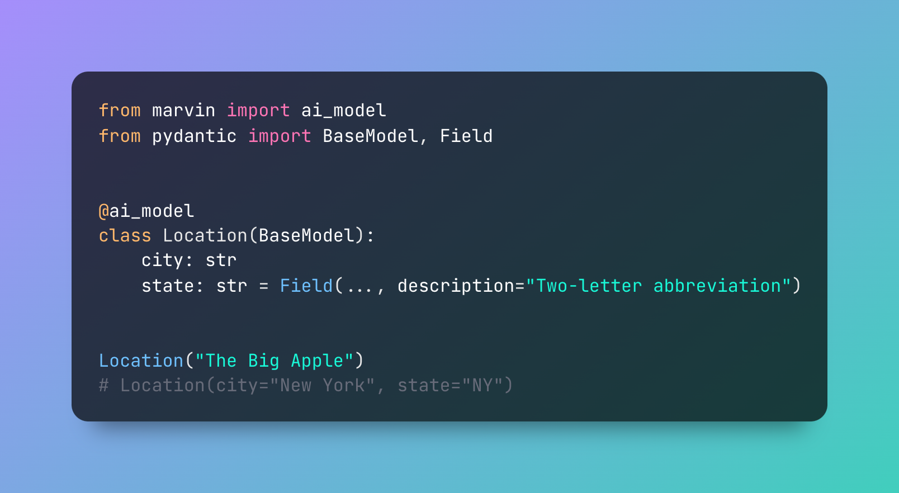

# Marvin

### The AI engineering framework

Marvin is a lightweight AI engineering framework for building natural language interfaces that are reliable, scalable, and easy to trust.

Large Language Models (LLMs) are pretty cool, but let's face it, they can be a headache to integrate. So, we decided to take the fuss out of the process. Marvin is our answer to the challenge: a neat, flexible tool that works as hard as you do.

Sometimes the most challenging part of working with generative AI is remembering that it's not magic; it's software. It's new, it's nondeterministic, and it's incredibly powerful, but it's still software: parameterized API calls that can trigger dependent actions (and just might talk like a pirate). Marvin's goal is to bring the best practices of building dependable, observable software to the frontier of generative AI. As the team behind [Prefect](https://github.com/prefecthq/prefect), which does something very similar for data engineers, we've poured years of open-source developer tool experience (and a few hard-won lessons!) into Marvin's design.

### Developer Experience

Above all else, Marvin is focused on a rock-solid developer experience. It's ergonomic and opinionated at every layer, but also incrementally adoptable so you can use it as much or as little as you like. It’s a Swiss Army Knife, not a kitchen sink. It’s familiar. It feels like the library you’d write if you had the time: simple, accessible, portable LLM abstractions that you can quickly deploy in your application, whether you’re doing straightforward NLP or building a full-featured autonomous agent.

Marvin prioritizes a developer experience focused on speed and reliability. It's built with type-safety and observability as first-class citizens. Its abstractions are Pythonic, simple, and self-documenting. These core primitives let us build surprisingly complex agentic software without sacrificing control:

🧩 **AI Models** for structuring text into type-safe schemas

🏷️ **AI Classifiers** for bulletproof classification and routing

🪄 **AI Functions** for complex business logic and transformations

🤝 **AI Applications** for interactive use and persistent state

### Ambient AI

With Marvin, we’re taking the first steps on a journey to deliver [Ambient AI](https://twitter.com/DrJimFan/status/1657782710344249344): omnipresent but unobtrusive autonomous routines that act as persistent translators for noisy, real-world data. Ambient AI makes unstructured data universally accessible to traditional software, allowing the entire software stack to embrace AI technology without interrupting the development workflow. Marvin brings simplicity and stability to AI engineering through abstractions that are reliable and easy to trust. 

Marvin's 1.0 release reflects our confidence that its core abstractions are locked-in. And why wouldn't they be? They're the same interfaces you use every day: Python functions, classes, enums, and Pydantic models. Our next objectives are leveraging these primitives to build production deployment patterns and an observability platform.

To hit the ground running, please read Marvin's [getting started docs](https://www.askmarvin.ai/welcome/what_is_marvin/). 

## Quick Install

Marvin can be installed with pip:

```bash
pip install marvin
```

For more information please see the [installation docs](https://www.askmarvin.ai/src/getting_started/installation/).

## Documentation
Marvin's docs are available at [askmarvin.ai](https://www.askmarvin.ai), including concepts, tutorials, and an API reference.

## Community
The heart of our community beats in our Discord server. It's a space where you can ask questions, share ideas, or just chat with like-minded developers. Don't be shy, join us on [Discord](https://discord.gg/Kgw4HpcuYG) or [Twitter](https://twitter.com/AskMarvinAI)!


## Core AI Components

Marvin's high-level abstractions are familiar Python interfaces that make it easy to leverage AI in your application. These interfaces aim to be simple and self-documenting, adding a touch of AI magic to everyday objects.

### 🧩 AI Models

Marvin's most basic component is the AI Model, a drop-in replacement for Pydantic's `BaseModel`. AI Models can be instantiated from any string, making them ideal for structuring data, entity extraction, and synthetic data generation. 

You can learn more about AI models [here](https://www.askmarvin.ai/components/ai_model/).

```python
from marvin import ai_model
from pydantic import BaseModel, Field


@ai_model
class Location(BaseModel):
    city: str
    state: str = Field(..., description="The two-letter state abbreviation")


Location("The Big Apple")
# Location(city='New York', state='NY')
```

### 🏷️ AI Classifiers

AI Classifiers let you build multi-label classifiers with no code and no training data. Given user input, each classifier uses a [clever logit bias trick](https://twitter.com/AAAzzam/status/1669753721574633473) to force an LLM to deductively choose the best option. It's bulletproof, cost-effective, and lets you build classifiers as quickly as you can write your classes.

You can learn more about AI Classifiers [here](https://www.askmarvin.ai/components/ai_classifier/).

```python
from marvin import ai_classifier
from enum import Enum


@ai_classifier
class AppRoute(Enum):
    """Represents distinct routes command bar for a different application"""

    USER_PROFILE = "/user-profile"
    SEARCH = "/search"
    NOTIFICATIONS = "/notifications"
    SETTINGS = "/settings"
    HELP = "/help"
    CHAT = "/chat"
    DOCS = "/docs"
    PROJECTS = "/projects"
    WORKSPACES = "/workspaces"


AppRoute("update my name")
# AppRoute.USER_PROFILE
```
### 🪄 AI Functions

AI Functions look like regular functions, but have no source code. Instead, an AI uses their description and inputs to generate their outputs, making them ideal for NLP applications like sentiment analysis. 

You can learn more about AI Functions [here](https://www.askmarvin.ai/components/ai_function/).


```python
from marvin import ai_fn


@ai_fn
def sentiment(text: str) -> float:
    """
    Given `text`, returns a number between 1 (positive) and -1 (negative)
    indicating its sentiment score.
    """


sentiment("I love working with Marvin!") # 0.8
sentiment("These examples could use some work...") # -0.2
```

### 🤝 AI Applications

AI Applications permit interactive use cases and are designed to be invoked multiple times. They maintain three forms of state: the application's own `state`, the AI's `plan`, and a `history` of interactions. AI Applications can be used to implement many "classic" LLM use cases, such as chatbots, tool-using agents, developer assistants, and more. In addition, thanks to their persistent state and planning, they can implement applications that don't have a traditional chat UX, such as a ToDo app. Here's an example:

```python
from datetime import datetime
from pydantic import BaseModel, Field
from marvin import AIApplication


# create models to represent the state of our ToDo app
class ToDo(BaseModel):
    title: str
    description: str = None
    due_date: datetime = None
    done: bool = False


class ToDoState(BaseModel):
    todos: list[ToDo] = []


# create the app with an initial state and description
todo_app = AIApplication(
    state=ToDoState(),
    description=(
        "A simple todo app. Users will provide instructions for creating and updating"
        " their todo lists."
    ),
)

# invoke the application by adding a todo
response = todo_app("I need to go to the store tomorrow at 5pm")


print(f"Response: {response.content}\n")
# Response: Got it! I've added a new task to your to-do list. You need to go to the store tomorrow at 5pm.


print(f"App state: {todo_app.state.json(indent=2)}")
# App state: {
#   "todos": [
#     {
#       "title": "Go to the store",
#       "description": "Buy groceries",
#       "due_date": "2023-07-12T17:00:00+00:00",
#       "done": false
#     }
#   ]
# }
```


## Things Marvin can build in 5 minutes (seriously) 

#### Scalable APIs, data pipelines, and agents

🏷️ Build bulletproof and lightning-fast classifiers

🧩 Extract structured data from unstructured text 

🧪 Generate synthetic data for your applications 

🫡 Solve complex deductive and inferential tasks at scale

🔎 Scrape web data without custom scrapers


#### Chatbots with access to tools, data, and the web
😍 Customize ChatGPT with system prompts and tools

🎓 Extract relevant insights from your data

🧑‍💻 Add a junior developer to your team

🗣️ Quickly add NLP to your app

#### Coming soon...
📱 AI applications with persistent state

🕵️ Autonomous agents with high-level planning

💬 Text-to-application: generate stateful applications by describing them
