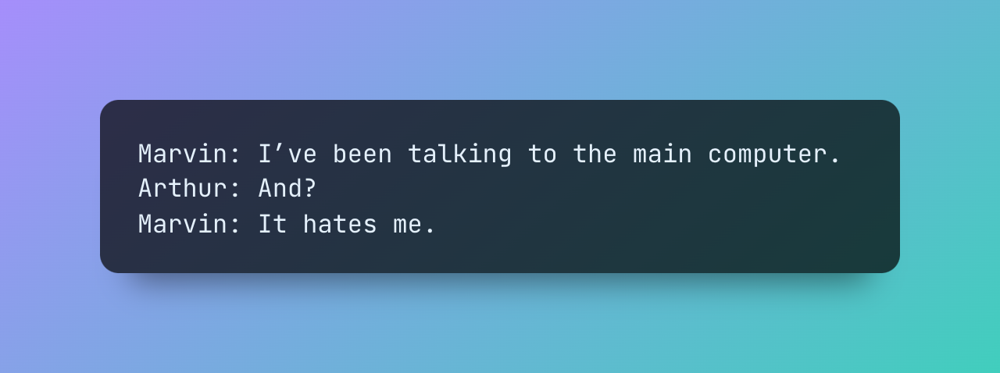

<p align="center">
  
</p>

# Marvin
[](https://badge.fury.io/py/marvin)
[](https://www.askmarvin.ai)
[](https://twitter.com/AskMarvinAI)

### The AI engineering toolkit
Marvin is a lightweight AI toolkit for building natural language interfaces that are reliable, scalable, and easy to trust. Marvin lets you use LLMs by writing code, not prompts. It's open source, free to use, rigorously type-hinted, and used by thousands of engineers.

Each of Marvin's tools is simple and self-documenting, using AI to solve common but complex challenges like entity extraction, generating example data, and classifying text. Each tool is independent and incrementally adoptable so you can use it alone or in combination with any other library.  Marvin also has tools for multi-modal use cases like image generation, vision, and speech. 

Marvin is made with 💙 by the team at [Prefect](https://www.prefect.io/).

## Installation

```bash
pip install marvin
```
Install the latest version with `pip`, then check out the [getting started](https://www.askmarvin.ai/welcome/installation/) guide.

Marvin uses OpenAI models, so you'll need to configure an OpenAI API key before using it. 


## Tools

Marvin contains a variety of useful tools, each designed for independent, incremental use. Even though they all use AI Magic™️, each one should feel familiar and fit right into your existing workflows.

Each tool in this list is available as a top-level import e.g. `marvin.fn`, `marvin.classify`, etc.


### General

⚙️ `@fn`: use AI to produce any function's output, without generating source code

🧩 `@model`: use AI to instantiate Pydantic models

### Text

🪄 `cast`: transform text into structured types

🔍 `extract`: find structured entities in text

🏷️ `classify` / `@classifier`: categorize text with labels

✨ `generate`: produce structured data from a schema

### Images

🖼️ `paint` / `@image`: generate images from text or functions

🪄 `cast_vision`: transform images into structured types

🔍 `extract_vision`: find structured entities in images

🏷️ `classify_vision`: categorize images with labels

### Audio

🎙️ `speak` / `@speech`: generate speech from text or functions

### Interaction

🤖 `Assistants` (*beta*): work interactively with AI

🧭 `Applications` (*beta*): manage state through natural language


## Quickstart

This is a whirlwind tour of a few of Marvin's main features. For more information, check the docs!

### 🪄 Cast text to types
Marvin can `cast` arbitrary text to any Python type:
```python
import marvin

marvin.cast("one two three", list[int]) 
# [1, 2, 3]
```

Like most Marvin tools, `cast` also supports Pydantic models:

```python
from pydantic import BaseModel, Field

class Location(BaseModel):
    city: str
    state: str = Field(description='2-letter abbreviation')

marvin.cast('The Big Apple', Location) 
# Location(city="New York", state="NY")
```

### 🔍 Extract data from text

Marvin can `extract` items mentioned in text:


```python
marvin.extract('I moved from NY to CHI', Location) 
# [
#   Location(city="New York", state="NY"), 
#   Location(city="Chcago", state="IL")
# ]
```

Almost all Marvin functions can be given `instructions` for more control:
```python
marvin.extract(
    'I paid $10 for 3 tacos and got a dollar and 25 cents back.', 
    float, 
    instructions='money'
)
# [10.0, 1.25]
```

### 🏷️ Classify text
Marvin can `classify` text with a set of labels:

```python
marvin.classify('I love this feature', labels=['positive', 'negative'])
# 'positive'
```

### ✨ Generate data
Marvin can `generate` data for you:
```python
from pydantic import BaseModel

class Location(BaseModel):
    city: str
    state: str

marvin.generate(
    Location, 
    n=4, 
    instructions="cities in the United States named after famous people"
)
# [
#     Location(city='Washington', state='District of Columbia'),
#     Location(city='Jackson', state='Mississippi'),
#     Location(city='Cleveland', state='Ohio'),
#     Location(city='Lincoln', state='Nebraska'),
# ]
```

### ⚙️ Build AI-powered functions

Sometimes your transformation logic is more complex than `cast` or `classify` can handle. For these situations, Marvin introduces "AI functions" that can take any combination of inputs, instructions, and output types. AI functions are ideal for complex natural language processing or mapping combinations of inputs to outputs.

Marvin functions look exactly like regular functions, except that you don't have to write any source code. When these functions are called, an AI interprets their description and inputs and generates the output. 

Note that Marvin does NOT generate or execute source code, which would be unsafe for most use cases. Instead, it uses the LLM itself as a "runtime" to predict function outputs. That's actually why it can handle complex use cases that would be difficult or impossible to express as code.

You can learn more about functions [here](https://www.askmarvin.ai/components/functions/).

```python
@marvin.fn
def sentiment(text: str) -> float:
    """
    Returns a sentiment score for `text` 
    between -1 (negative) and 1 (positive).
    """


sentiment("I love working with Marvin!") # 0.8
sentiment("These examples could use some work...") # -0.2
```

Functions can also return more complex types, like [Pydantic models](https://pydantic-docs.helpmanual.io/usage/models/), [TypedDicts](https://docs.python.org/3/library/typing.html#typing.TypedDict), and [`Literals`](https://docs.python.org/3/library/typing.html#typing.Literal).


### 🧩  Create AI-powered models
Marvin AI models are based on Pydantic's [BaseModel](https://pydantic-docs.helpmanual.io/usage/models/), but with a twist: they are instantiated with plain text, and will use an LLM to infer their values. 

You can learn more about AI models [here](https://www.askmarvin.ai/components/models/).

```python
@marvin.model
class Location(BaseModel):
    city: str
    state: str = Field(description='2-letter abbreviation')


Location("The Big Apple")
# Location(city='New York', state='NY')
```

## Continue learning

To learn more about Marvin, please [read the docs](https://askmarvin.ai).


## Get in touch!

💡 **Feature idea?** share it in the `#development` channel in [our Discord](https://discord.com/invite/Kgw4HpcuYG).

🐛 **Found a bug?** feel free to [open an issue](https://github.com/PrefectHQ/marvin/issues/new/choose).

👷 **Feedback?** Marvin is under active development, and we'd love to [hear it](https://github.com/PrefectHQ/marvin/discussions).