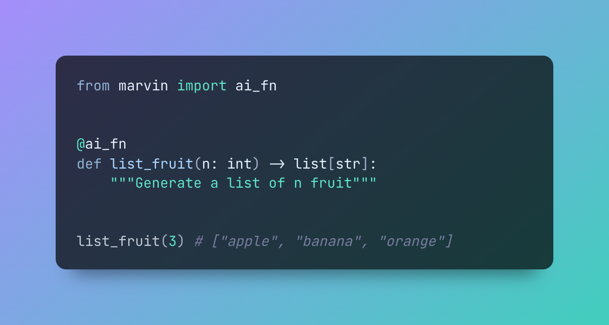

# Welcome to Marvin 🤖🏖️




Marvin is a batteries-included library designed to simplify the process of building AI-powered software. 

Marvin's innovative approach to **"functional prompt engineering"** allows developers to engage AI through structured inputs and outputs, seamlessly integrating it with traditional code and enabling the creation of sophisticated AI pipelines. **AI functions** let developers take advantage of AI through familiar function calls and data structures. **Bots** are highly capable AI assistants that are designed to be used alongside or within existing code. They can take instructions and leverage plugins or external knowledge to solve complex problems. Developers can use these tools to add AI capabilities where they are most impactful, without needing to start from scratch.

> "Let’s build robots with Genuine People Personalities," they said. So they tried it out with me. I’m a personality prototype. You can tell, can’t you?
>
> -- [Marvin](https://www.youtube.com/clip/UgkxNj9p6jPFM8eWAmRJiKoPeOmvQxb8viQv)


## Features


🦾 Write [AI functions](https://askmarvin.ai/guide/ai_functions) that process structured data without source code

🤖 Create [bots](https://www.askmarvin.ai/guide/bots) that have personalities and follow instructions

🔌 Build [plugins](https://askmarvin.ai/guide/plugins) to give bots new abilities

📚 Store [knowledge](https://askmarvin.ai/guide/loaders_and_documents) that bots can access and use

📡 Available as a Python API, interactive CLI, or FastAPI server

## Quick start
1. **Install**: `pip install marvin`
2. **Chat**: `marvin chat`

```shell
marvin chat -p "knows every Star Wars meme" Hello there
```


See the [getting started](https://www.askmarvin.ai/getting_started/installation/) docs for more!

## When should you use Marvin?

Marvin is an opinionated, high-level library with the goal of integrating AI tools into software development. There are a few major reasons to use Marvin:

1. **You want an [AI function](https://askmarvin.ai/guide/ai_functions) that can process structured data.** Marvin brings the power of AI to native data structures, letting you build functions that would otheriwse be difficult or even impossible to write. For example, you can use AI functions to make a list of all the animals in a paragraph, generate JSON documents from HTML content, extract keywords that match some criteria, or categorize sentiment -- without any traditional source code.

2. **You want an [AI assistant](https://askmarvin.ai/guide/bots) in your code.** Marvin's bots can follow instructions and hold conversations to solve complex problems. They can use custom plugins and take advantage of external knowledge. They are designed to be integrated into your codebase, but of course you can expose them directly to your users as well!

3. **You want to deploy cutting-edge AI technology with confidence, but without having to make too many decisions.** Using LLMs successfully requires very careful consideration of prompts, data preprocessing, and infrastructure. Our target user is more interested in *using* AI systems than *building* AI systems. Therefore, Marvin is designed to make adopting this technology as straightforward as possible by optimizing for useful outcomes. Marvin's prompts have been hardened by months of real-world use and will continue to improve over time.
## When should you NOT use Marvin?
There are a few reasons NOT to use Marvin:

1. **You want full control of the AI.** Marvin is a high-level library and (with few exceptions) does not generally expose LLM configuration to users. We have chosen settings that give the best results under most circumstances, taking Marvin's built-in prompts into consideration.

2. **You want to use other LLMs.** Marvin is designed to run against OpenAI's GPT-4 and GPT-3.5 models. While we may expand those models in the future, we've discovered that prompts designed for one model rarely translate well to others without modification. In order to maximize the usefulness of the library, we've decided to focus on just these popular models for now.

3. **You want full control of your prompts.** As a "functional prompt engineering" platform, Marvin takes user inputs and generates prompts that are likely to deliver the outcome the user wants, even if they are not verbatim what the user said. Marvin does not expect users to send completely raw prompts to the LLM. 

4. **You're searching for the Ultimate Question.** While Marvin is highly intelligent, even he couldn't come up with the Ultimate Question of Life, the Universe, and Everything. If you're seeking existential enlightenment, you might need to look beyond our beloved paranoid android.

