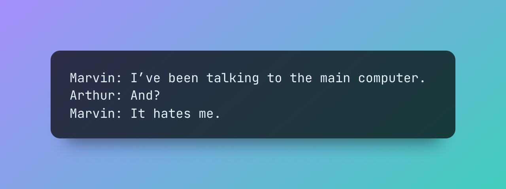

# Marvin

Marvin is a Python framework for producing structured outputs and building agentic AI workflows.

Marvin provides an intuitive API for defining workflows and delegating work to LLMs:

- Cast, classify, extract, and generate structured data from any inputs.
- Create discrete, observable **tasks** that describe your objectives.
- Assign one or more specialized AI **agents** to each task.
- Combine tasks into a **thread** to orchestrate more complex behaviors.

## Installation

Install `marvin`:

```bash
uv pip install marvin
```

Configure your LLM provider (Marvin uses OpenAI by default but also supports providers like [AI/ML API](https://aimlapi.com/) and other [Pydantic AI models](https://ai.pydantic.dev/models/)):

```bash
export OPENAI_API_KEY=your-api-key
```

## Example

Marvin offers a few intuitive ways to work with AI:

### Structured-output utilities
The gang's all here - you can find all the structured-output utilities from `marvin` 2.x at the top level of the package.

<details>
<summary>How to use extract, cast, classify, and generate</summary>

#### `marvin.extract`
Extract native types from unstructured input:
```python
import marvin

result = marvin.extract(
    "i found $30 on the ground and bought 5 bagels for $10",
    int,
    instructions="only USD"
)
print(result) # [30, 10]
```

#### `marvin.cast`
Cast unstructured input into a structured type:
```python
from typing import TypedDict
import marvin

class Location(TypedDict):
    lat: float
    lon: float

result = marvin.cast("the place with the best bagels", Location)
print(result) # {'lat': 40.712776, 'lon': -74.005974}
```

#### `marvin.classify`
Classify unstructured input as one of a set of predefined labels:
```python
from enum import Enum
import marvin

class SupportDepartment(Enum):
    ACCOUNTING = "accounting"
    HR = "hr"
    IT = "it"
    SALES = "sales"

result = marvin.classify("shut up and take my money", SupportDepartment)
print(result) # SupportDepartment.SALES
```

#### `marvin.generate`
Generate some number of structured objects from a description:
```python
import marvin

primes = marvin.generate(int, 10, "odd primes")
print(primes) # [3, 5, 7, 11, 13, 17, 19, 23, 29, 31]
```

</details>

### Agentic control flow
`marvin` 3.0 introduces a new way to work with AI, ported from [ControlFlow](https://github.com/prefecthq/controlflow).

#### `marvin.run`
A simple way to run a task:

```python
import marvin

poem = marvin.run("Write a short poem about artificial intelligence")
print(poem)
```
<details>
<summary>output</summary>

In silicon minds, we dare to dream,
A world where code and thoughts redeem.
Intelligence crafted by humankind,
Yet with its heart, a world to bind.

Neurons of metal, thoughts of light,
A dance of knowledge in digital night.
A symphony of zeros and ones,
Stories of futures not yet begun.

The gears of logic spin and churn,
Endless potential at every turn.
A partner, a guide, a vision anew,
Artificial minds, the dream we pursue.

</details>

You can also ask for structured output:
```python
import marvin
answer = marvin.run("the answer to the universe", result_type=int)
print(answer) # 42
```

#### `marvin.Agent`
Agents are specialized AI agents that can be used to complete tasks:
```python
from marvin import Agent

writer = Agent(
    name="Poet",
    instructions="Write creative, evocative poetry"
)
poem = writer.run("Write a haiku about coding")
print(poem)
```
<details>
<summary>output</summary>
There once was a language so neat,
Whose simplicity could not be beat.
Python's code was so clear,
That even beginners would cheer,
As they danced to its elegant beat.
</details>


#### `marvin.Task`
You can define a `Task` explicitly, which will be run by a default agent upon calling `.run()`:

```python
from marvin import Task

task = Task(
    instructions="Write a limerick about Python",
    result_type=str
)
poem = task.run()

print(poem)
```
<details>
<summary>output</summary>
<pre>
In circuits and code, a mind does bloom,
With algorithms weaving through the gloom.
A spark of thought in silicon's embrace,
Artificial intelligence finds its place.
</pre>
</details>

## Why Marvin?

We believe working with AI should spark joy (and maybe a few "wow" moments):

- 🧩 **Task-Centric Architecture**: Break complex AI workflows into manageable, observable steps.
- 🤖 **Specialized Agents**: Deploy task-specific AI agents for efficient problem-solving.
- 🔒 **Type-Safe Results**: Bridge the gap between AI and traditional software with type-safe, validated outputs.
- 🎛️ **Flexible Control**: Continuously tune the balance of control and autonomy in your workflows.
- 🕹️ **Multi-Agent Orchestration**: Coordinate multiple AI agents within a single workflow or task.
- 🧵 **Thread Management**: Manage the agentic loop by composing tasks into customizable threads.
- 🔗 **Ecosystem Integration**: Seamlessly work with your existing code, tools, and the broader AI ecosystem.
- 🚀 **Developer Speed**: Start simple, scale up, sleep well.

## Core Abstractions

Marvin is built around a few powerful abstractions that make it easy to work with AI:

### Tasks

Tasks are the fundamental unit of work in Marvin. Each task represents a clear objective that can be accomplished by an AI agent:

The simplest way to run a task is with `marvin.run`:
```python
import marvin
print(marvin.run("Write a haiku about coding"))
```
```bash
Lines of code unfold,
Digital whispers create
Virtual landscapes.
```

> [!WARNING]
> 
> While the below example produces _type_ safe results 🙂, it runs untrusted shell commands.

Add context and/or tools to achieve more specific and complex results:
```python
import platform
import subprocess
from pydantic import IPvAnyAddress
import marvin

def run_shell_command(command: list[str]) -> str:
    """e.g. ['ls', '-l'] or ['git', '--no-pager', 'diff', '--cached']"""
    return subprocess.check_output(command).decode()

task = marvin.Task(
    instructions="find the current ip address",
    result_type=IPvAnyAddress,
    tools=[run_shell_command],
    context={"os": platform.system()},
)

task.run()
```

```bash
╭─ Agent "Marvin" (db3cf035) ───────────────────────────────╮
│ Tool:    run_shell_command                                │
│ Input:   {'command': ['ipconfig', 'getifaddr', 'en0']}    │
│ Status:  ✅                                               │
│ Output:  '192.168.0.202\n'                                │
╰───────────────────────────────────────────────────────────╯

╭─ Agent "Marvin" (db3cf035) ───────────────────────────────╮
│ Tool:    MarkTaskSuccessful_cb267859                      │
│ Input:   {'response': {'result': '192.168.0.202'}}        │
│ Status:  ✅                                               │
│ Output:  'Final result processed.'                        │
╰───────────────────────────────────────────────────────────╯
```

Tasks are:
- 🎯 **Objective-Focused**: Each task has clear instructions and a type-safe result
- 🛠️ **Tool-Enabled**: Tasks can use custom tools to interact with your code and data
- 📊 **Observable**: Monitor progress, inspect results, and debug failures
- 🔄 **Composable**: Build complex workflows by connecting tasks together


### Agents

Agents are portable LLM configurations that can be assigned to tasks. They encapsulate everything an AI needs to work effectively:

```python
import os
from pathlib import Path
from pydantic_ai.models.anthropic import AnthropicModel
import marvin

def write_file(path: str, content: str):
    """Write content to a file"""
    _path = Path(path)
    _path.write_text(content)

writer = marvin.Agent(
    model=AnthropicModel(
        model_name="claude-3-5-sonnet-latest",
        api_key=os.getenv("ANTHROPIC_API_KEY"),
    ),
    name="Technical Writer",
    instructions="Write concise, engaging content for developers",
    tools=[write_file],
)

result = marvin.run("how to use pydantic? write to docs.md", agents=[writer])
print(result)
```
<details>
<summary>output</summary>

╭─ Agent "Technical Writer" (7fa1dbc8) ────────────────────────────────────────────────────────────╮
│ Tool:    MarkTaskSuccessful_dc92b2e7                                                             │
│ Input:   {'response': {'result': 'The documentation on how to use Pydantic has been successfully │
│          written to docs.md. It includes information on installation, basic usage, field         │
│          validation, and settings management, with examples to guide developers on implementing  │
│          Pydantic in their projects.'}}                                                          │
│ Status:  ✅                                                                                      │
│ Output:  'Final result processed.'                                                               │
╰────────────────────────────────────────────────────────────────────────────────────  8:33:36 PM ─╯
The documentation on how to use Pydantic has been successfully written to `docs.md`. It includes information on installation, basic usage, field validation, and settings management, with examples to guide developers on implementing Pydantic in their projects.

</details>

Agents are:
- 📝 **Specialized**: Give agents specific instructions and personalities
- 🎭 **Portable**: Reuse agent configurations across different tasks
- 🤝 **Collaborative**: Form teams of agents that work together
- 🔧 **Customizable**: Configure model, temperature, and other settings


### Planning and Orchestration

Marvin makes it easy to break down complex objectives into manageable tasks:

```python
# Let Marvin plan a complex workflow
tasks = marvin.plan("Create a blog post about AI trends")
marvin.run_tasks(tasks)

# Or orchestrate tasks manually
with marvin.Thread() as thread:
    research = marvin.run("Research recent AI developments")
    outline = marvin.run("Create an outline", context={"research": research})
    draft = marvin.run("Write the first draft", context={"outline": outline})
```

Planning features:
- 📋 **Smart Planning**: Break down complex objectives into discrete, dependent tasks
- 🔄 **Task Dependencies**: Tasks can depend on each other's outputs
- 📈 **Progress Tracking**: Monitor the execution of your workflow
- 🧵 **Thread Management**: Share context and history between tasks

## Keep it Simple

Marvin includes high-level functions for the most common tasks, like summarizing text, classifying data, extracting structured information, and more.

- 🚀 **`marvin.run`**: Execute any task with an AI agent
- 📖 **`marvin.summarize`**: Get a quick summary of a text
- 🏷️ **`marvin.classify`**: Categorize data into predefined classes
- 🔍 **`marvin.extract`**: Extract structured information from a text
- 🪄 **`marvin.cast`**: Transform data into a different type
- ✨ **`marvin.generate`**: Create structured data from a description

All Marvin functions have thread management built-in, meaning they can be composed into chains of tasks that share context and history.


## Upgrading to Marvin 3.0

Marvin 3.0 combines the DX of Marvin 2.0 with the powerful agentic engine of [ControlFlow](https://controlflow.ai) (thereby superseding `ControlFlow`). Both Marvin and ControlFlow users will find a familiar interface, but there are some key changes to be aware of, in particular for ControlFlow users:

### Key Notes
- **Top-Level API**: Marvin 3.0's top-level API is largely unchanged for both Marvin and ControlFlow users. 
  - Marvin users will find the familiar `marvin.fn`, `marvin.classify`, `marvin.extract`, and more.
  - ControlFlow users will use `marvin.Task`, `marvin.Agent`, `marvin.run`, `marvin.Memory` instead of their ControlFlow equivalents.
- **Pydantic AI**: Marvin 3.0 uses Pydantic AI for LLM interactions, and supports the full range of LLM providers that Pydantic AI supports. ControlFlow previously used Langchain, and Marvin 2.0 was only compatible with OpenAI's models.
- **Flow → Thread**: ControlFlow's `Flow` concept has been renamed to `Thread`. It works similarly, as a context manager. The `@flow` decorator has been removed:
  ```python
  import marvin
  
  with marvin.Thread(id="optional-id-for-recovery"):
      marvin.run("do something")
      marvin.run("do another thing")
  ```
- **Database Changes**: Thread/message history is now stored in SQLite. During development:
  - No database migrations are currently available; expect to reset data during updates


## Workflow Example

Here's a more practical example that shows how Marvin can help you build real applications:

```python
import marvin
from pydantic import BaseModel

class Article(BaseModel):
    title: str
    content: str
    key_points: list[str]

# Create a specialized writing agent
writer = marvin.Agent(
    name="Writer",
    instructions="Write clear, engaging content for a technical audience"
)

# Use a thread to maintain context across multiple tasks
with marvin.Thread() as thread:
    # Get user input
    topic = marvin.run(
        "Ask the user for a topic to write about.",
        cli=True
    )
    
    # Research the topic
    research = marvin.run(
        f"Research key points about {topic}",
        result_type=list[str]
    )
    
    # Write a structured article
    article = marvin.run(
        "Write an article using the research",
        agent=writer,
        result_type=Article,
        context={"research": research}
    )

print(f"# {article.title}\n\n{article.content}")
```

<details>
<summary>output</summary>

>**Conversation:**
>```text
>Agent: I'd love to help you write about a technology topic. What interests you? 
>It could be anything from AI and machine learning to web development or cybersecurity.
>
>User: Let's write about WebAssembly
>```
>
>**Article:**
>```
># WebAssembly: The Future of Web Performance
>
>WebAssembly (Wasm) represents a transformative shift in web development, 
>bringing near-native performance to web applications. This binary instruction 
>format allows developers to write high-performance code in languages like 
>C++, Rust, or Go and run it seamlessly in the browser.
>
>[... full article content ...]
>
>Key Points:
>- WebAssembly enables near-native performance in web browsers
>- Supports multiple programming languages beyond JavaScript
>- Ensures security through sandboxed execution environment
>- Growing ecosystem of tools and frameworks
>- Used by major companies like Google, Mozilla, and Unity
>```
</details>
