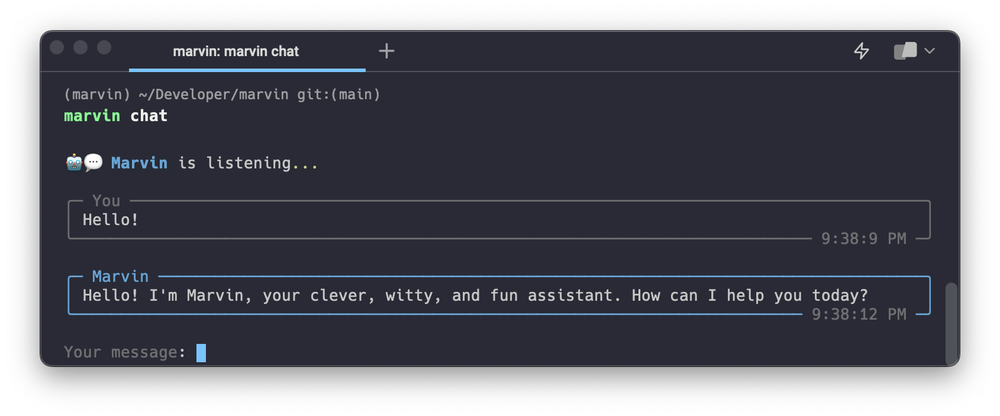

# Chat
<!-- <figure markdown> -->


<!-- </figure> -->
## Quick chat

To quickly jump into a chat, run `marvin chat` from your command line. This will open a new session with the default chatbot, whose name is Marvin. You can type messages to the bot, and it will respond. 

```shell
marvin chat
```

## Custom chat

You can customize the bot's name, personality, or instructions by providing the appropriate CLI flags:

```
--name / -n: customize the bot's name
--personality / -p: customize the bot's personality
--instructions / -i: customize the bot's instructions
```

Generally, Marvin bots use `personality` to inform the style of their response and `instructions` to inform the form of their response. For example, you might give a bot an instruction to always respond a certain way (e.g. with a code example, or with a question), or you might give it a personality that makes it more (or less) pleasant to interact with or reflects certain goals. You can combine personality and instructions to get interesting results.

```bash
marvin chat -n "Ford" -p "a roving research for the Hitchhiker's Guide to the Galaxy"
```
