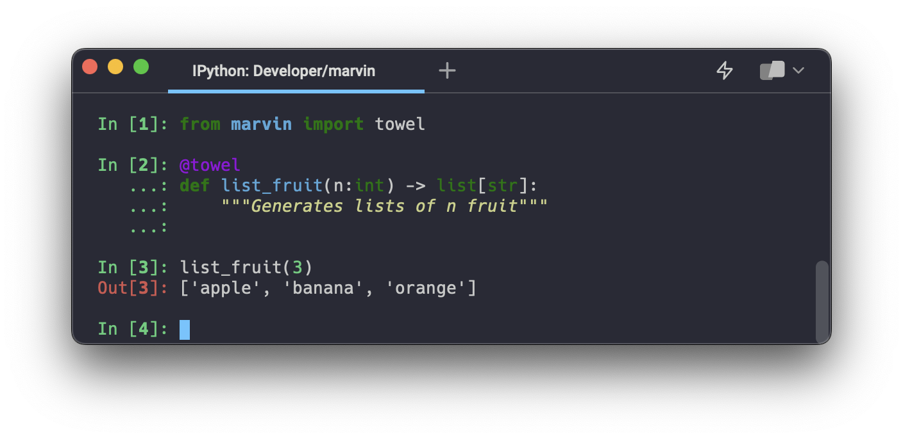

# Towel

Towel is a decorator that uses AI to generate outputs from a function -- without ever writing the function!

To use it, apply the decorator to a function definition. Your function definition should include a descriptive name, annotated inputs, an annotated return type, and a docstring. 

For more information about towel, including examples and how to include executable code in your function, see the [towel concept docs](towel.md).