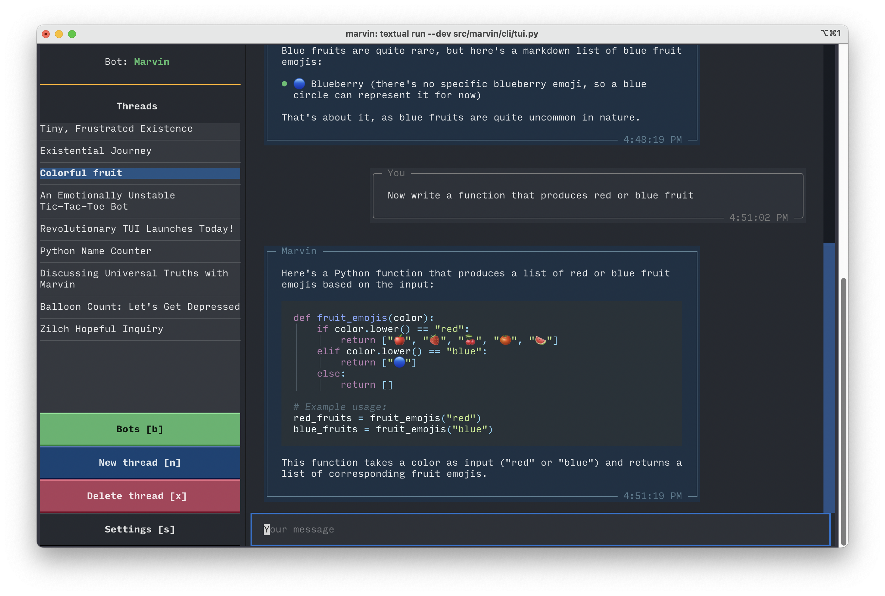

# 🤖 Bots


!!! tip "Features"
    
    🤖 Create bots with distinct personalities and instructions

    🔌 Use plugins to give bots new capabilities

    💬 Persistent memories let you resume threads from different sessions

    📡 Talk to bots from Python, your CLI, or the Marvin REST API

One of Marvin's central abstractions is the `Bot` class. A bot is an interface to send text to an AI and receive a response that aligns with the user's objective as much as possible. Marvin allows users to customize this behavior in ways that can transform bots from "AI assistants" to reusable programs.

## When to use bots

Bots are different than [AI functions](ai_functions.md) and, in some ways, are more powerful. In fact, AI functions are actually powered by bots. AI functions are designed to take well-scoped problems and turn them into familiar, reusable functions. While bots can be used for the same purpose, they are more appropriate for complex, multi-step interactions or problem solving. 

AI functions are designed to make the AI invisible. Bots bring the AI to the forefront.

## Python

### Interactive use
To create a bot, instantiate the bot class. 
```python
from marvin import Bot

ford_bot = Bot(
    name="Ford", 
    personality="Can't get the hang of Thursdays", 
    instructions="Always responds as if researching an article for the Hitchhiker's Guide to the Galaxy"
)
```

You can immediately talk to the bot by calling its `say()` method, which is an async coroutine.

```python
await ford_bot.say("Hello!")
```

### History
When you speak with a bot, every message is automatically stored. The bot uses its `history` module to access these messages, which means you can refer to earlier parts of your conversation without any extra work. 

In Marvin, each conversation is called a `thread`. Bots generate a new thread each time they are instantiated.  

Clear the thread and start a new one by calling `Bot.reset_thread()`. 

Resume a specific thread by calling `Bot.set_thread()`.

### Saving bots

Bots can be saved to the database by calling the `Bot.save()` method. Bots are saved by name. 


```python
bot = Bot("Ford")
await bot.save()
```

Use the `if_exists` argument to customize what happens if a bot with the same name already exists:

- `None` (the default): an error will be raised.
- `"delete"`: the old bot will be deleted and a new bot will be saved. The new bot will not share anything with the old bot, including its message history.
- `"update"`: the old bot will be updated with the new bot's details. The ID and message history will be preserved.
- `"cancel"`: no changes are made and the old bot is left untouched, but no error is raised.

```python
bot = Bot("Ford")
await bot.save(if_exists="update")
```

### Loading bots

Bots can be loaded with the `Bot.load()` method.

```python
bot = await Bot.load("Ford")
```

### Streaming responses
By default, bots process an entire response and return it as a structured object. However, you can get a streaming response by providing a custom `on_token_callback` function. Every time the bot generates a token, the callback will be called with a buffer of all the tokens generated to that point. You can access the most recent token as `buffer[-1]`. 

For example, to print each token as it's generated:
```python
bot = marvin.Bot()
await bot.say("Hello!", on_token_callback=lambda buffer: print(buffer[-1]))
```

### Async and sync methods
Above you've seen how to use asynchronous methods. If needed, synchronous convenience methods are also provided. Just append `_sync` to the asynchronous method name.

Synchronous substitue for async `say()` method:
```python
ford_bot.say_sync("Hello again!")
``` 

Synchronous substitute for async `save()` method:
```python
bot = Bot("Ford")
bot.save_sync()
```

Synchronous substitute for async `load()` method:
```python
bot = Bot.load_sync("Ford")
```

Callbacks can be synchronous or asynchronous, and both can be used with the bot's async `say()` or synchronous `say_sync()` methods.

## TUI

### Interactive use

To chat with a bot from your terminal, run `marvin chat`



### Loading an existing bot

If you have saved a bot, you can load it in the CLI by using the `-b` flag and providing the bot's name:

```shell
marvin chat -b Arthur
```
## Customization 
### Name
Names are unique identifiers that make it easy to reference a specific bot.

### Instructions
Instructions define the bot's behavior by specifying how it should respond to questions. For example, the default instructions are to assist the user. However, more utilitarian bots might be instructed to only respond with JSON (or with a specific JSON schema), extract keywords, always rhyme, etc. Bots, especially GPT-4 bots, should not go against their instructions at any time.

!!! "Customizing Instruction Templates"
    While the default instruction template serves most Bot use-cases well, it can be customized by passing a `instructions_template: str` to a `Bot`. Note that
    the following variables will still be passed to your instructions template when the bot retrieves its instructions: `name`, `instructions`, `response_format`, 
    `personality`, `date`. **Warning:** Custom instruction templates may cause incompatibilities with future Marvin versions.

### Personality


Personality affects the style of a bot's responses. For example different bots can have different tones, senses of humor, or frequency of confirmation checks. Personality can include a persona or role as well as interests, fears, or broad objectives. 

By combining personality and instructions, bot instances can produce complex behavior that can be very different from what users might expect from a chat interface. For example, you could instruct a bot to always respond in a certain way, but use personality to have it act a role (such as a coach, engineer, or therapist).

### Plugins
[Plugins](./plugins/) allow bots to access new information and functionality. By default, bots have plugins that let them browse the internet, visit URLs, and run simple calculations.

### Formatting responses

You can optionally enforce certain formats for the bot's responses. In some cases, you can also validate and even parse the resulting output into native objects.

Please note: complex response formatting is significantly better with GPT-4 than GPT-3.5.

To set up formatting, you need to supply a `ResponseFormatter` object that defines formatting, validation, and parsing. 

As a convenience, Marvin also supports a shorthand way of defining formats that will let the library select the most appropriate `ResponseFormatter` automatically. Shorthand formats can include natural language descriptions, Python types, JSON instructions, or Pydantic models. 

Here are examples of various shorthand formats:

#### Python types

Supply Python types to have the bot enforce the appropriate return types. Python types are always validated and parsed.

```python
bot = Bot(response_format=bool)
response = await bot.say('Are these statements equivalent? 1: The coffee is hot. 2: The coffee is scalding.')

print(response.parsed_content) # True
```

```python
bot = Bot(response_format=list[dict[str, int]])
response = await bot.say("Format this: (x is 1, y is two), (a is 3, b is 4)")

print(response.parsed_content) # [{'x': 1, 'y': 2}, {'a': 3, 'b': 4}]
```

#### Natural language

You can describe the format you want the bot to use, and it will do its best to follow your instructions. If your description includes the word "json", then it will also be parsed and validated (you can enable this explicitly by providing a `JSONResponseFormatter`).

```python
bot = Bot(response_format="a JSON list of strings")
response = await bot.say("Which of these are capitalized: Apple, banana, cherry, Date, elephant")

print(response.parsed_content) # ["Apple", "Date"]
```

```python
bot = Bot(response_format="a hyphenated list")
response = await bot.say("Which of these are capitalized: Apple, banana, cherry, Date, elephant")

print(response.parsed_content) # '- Apple\n- Date'
```

```python
bot = Bot(response_format='<animal> like to eat <food> and live in <biome>')
response = await bot.say('tell me about foxes')

print(response.parsed_content) # "Foxes like to eat small mammals and live in forests."
```

#### Pydantic

```python
class MyFormat(BaseModel):
    x: int
    y: str = Field("The written form of x")

bot = Bot(response_format=MyFormat)
response = await bot.say("Generate output where x is 22")

print(response.parsed_content) # MyFormat(x=22, y='Twenty-two')
```
