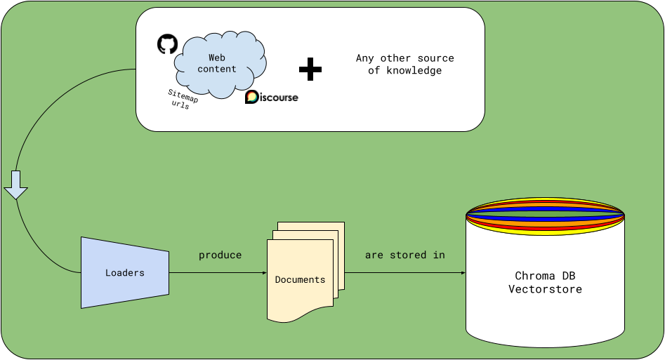

# 🏗️ Loaders & Documents

!!! warning "Construction zone"
    Loaders are under active development and may change.

## Quickstart 
```python
import asyncio
from marvin.loaders.web import SitemapLoader

# loader that can parse text from all urls in a sitemap
prefect_docs = SitemapLoader(
    urls=["https://docs.prefect.io/sitemap.xml"],
    exclude=["api-ref"],
)

# load, embed, store in Chroma locally at ~/.marvin/chroma/*.parquet
asyncio.run(prefect_docs.load_and_store())
```
## 
A `Loader` parses a source of information into a `list[Document]`, which can then be stored as context for the LLM.





## What is a `Document`?
A `Document` is a rich Pydantic model that represents a store-able and searchable unit of information. 

A valid `Document` only requires one attribute, `text`: the raw text of the document.

```python
from marvin.models.document import Document

document = Document(text="This is a document.")
```

You can attach arbitrary `Metadata` to a `Document`.

```python
from marvin.models.documents import Document
from marvin.models.metadata import Metadata

my_document = Document(
    text="This is a document.",
    metadata=Metadata(
        title="My Document",
        link="https://www.example.com",
        random_metadata_field="This is very important to me!"
    )
)
```

### Creating excerpts from a `Document`
`Document` offers a `to_excerpts` method that splits a `Document` into a `list[Document]` which are rich excerpts of the original.

```python
# using the same document as above
my_document.to_excerpts()

# yields
[
    Document(
        id='doc_01GWMH5VA91P0SSYJXE9N7ZK88',
        text='The following is a original document \n# Document metadata\n        Link: https://www.example.com\nTitle: My Document\nSource: unknown\nDocument_type: original\nRandom_metadata_field: This is very important to me!\n# Excerpt content: This is a document.',
        embedding=None,
        metadata=Metadata(
            link='https://www.example.com',
            title='My Document',
            source='unknown',
            document_type='excerpt',
            random_metadata_field='This is very important to me!'
            ),
        source=None,
        type='excerpt',
        parent_document_id='doc_01GWMH58XYXFB8JQYC2T6VMFYC',
        topic_name='marvin',
        tokens=55,
        order=0,
        keywords=['document']
    )
]
```
Here, since our `Document` is short, there's only one excerpt. Longer documents are split into many excerpts according to the `chunk_tokens` argument of `to_excerpts`.

You'll notice that the `Document`'s `text` attribute has been replaced with a rich excerpt that includes the original `Document`'s `Metadata` and the excerpt's location in the original `Document`. This helps provide more context to the LLM when it's searching for answers.

<!-- 
### **Optional**: Bring your own `embedding`
You'll notice above that the `Document`'s `embedding` attribute is `None`. The Chroma vectorstore will automatically create an embedding for each `Document` when it's stored. However, if you already have an embedding for your `Document`, you can pass it in when you create the `Document`:

```python
from marvin.models.document import Document

my_document = Document(
    text="This is a document.",
    embedding=[0.1, 0.2, 0.3, 0.4, 0.5] # not a real embedding
)
``` 
-->

## How can I create my own `Loader`?

One way or another, a `Loader` must return a `list[Document]`. These `Document`s can be created in any way you like, but their `text` must have fewer tokens than the limit for your embedding function. 

> For example, if you're using Marvin's default: OpenAI's `text-embedding-ada-002`, the limit is 8191 tokens.

This is where `Document.to_excerpts` comes in handy. 

You can create a `Document` with a large `text` attribute, and split it into many `Document` excerpts to `extend` the `list[Document]` you're returning - the bonus being that you'll get rich excerpts as described above.


### **Example: `PokemonLoader`**

For example, one could create a `PokemonLoader` that loads Pokemon data from the [PokeAPI](https://pokeapi.co/).

```python
import httpx
import asyncio
from marvin.loaders.base import Loader
from marvin.models.documents import Document
from marvin.models.metadata import Metadata

async def fetch_data(url: str) -> dict:
    async with httpx.AsyncClient() as client:
        return (await client.get(url)).json()

async def create_document(url: str) -> Document:
    pokemon_data = await fetch_data(url)
    species_data = await fetch_data(pokemon_data['species']['url'])
    
    flavor_text = next(
        (
            entry['flavor_text'].replace('\n', ' ')
            for entry in species_data['flavor_text_entries']
            if entry['language']['name'] == 'en'
        ),
        ""
    )

    return Document(
        text=f"{pokemon_data['name'].capitalize()}: {flavor_text}",
        metadata=Metadata(
            title=pokemon_data['name'],
            pokemon_type=pokemon_data['types'][0]['type']['name']
        )
    )

class PokemonLoader(Loader):
    """Loads documents from the PokeAPI"""
    limit: int = 5

    async def load(self) -> list[Document]:
        async with httpx.AsyncClient() as client:
            response = await client.get(f"https://pokeapi.co/api/v2/pokemon?limit={self.limit}")
            data = response.json()

        documents = await asyncio.gather(
            *[create_document(pokemon['url']) for pokemon in data['results']]
        )
        excerpts = []

        for document in documents:
            excerpts.extend(await document.to_excerpts())
        
        return excerpts
```
> ‼️ **Note:**
>
> Like most of the code in Marvin, the `load` method must be `async`.


**Try it out!**
- copy the above code

- open `ipython` or `jupyter notebook` and run paste it in

- run: `await PokemonLoader(limit=5).load()`

