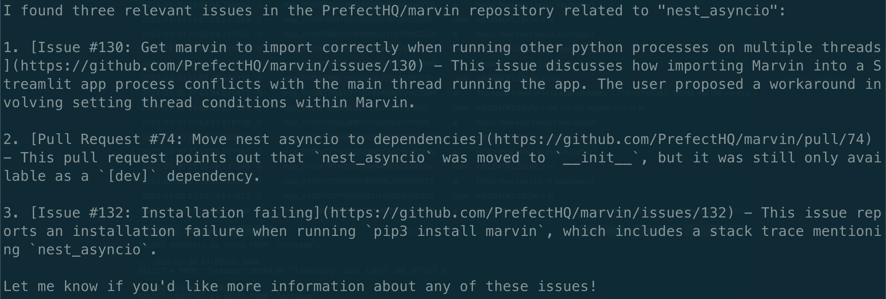

# 🔌 Plugins


!!! tip "Features"
    🦸 Give bots the ability to access new information and abilities
    
    🦾 Turn any function into a bot plugin

Plugins extend a bot's functionality by letting it call a function and see the returned value. Plugins must be provided to a bot when it is instantiated, and the bot will decide whether to use a plugin based on its description. Users can influence that choice through instruction (e.g. telling the bot to use a specific plugin). 

## Writing plugins

The simplest way to write a plugin is using the `@plugin` decorator. Note that plugin functions must have a docstring, as this is displayed to the bot so it can decide if it should use a plugin or not.

```python
from marvin import Bot, plugin
import random

@plugin
def random_number(min:float, max:float) -> float:
    """Use this plugin to generate a random number between min and max"""
    return min + (max - min) * random.random()

bot = Bot(plugins=[random_number])

await bot.say('Use the plugin to pick a random number between 41 and 43')
```

For more complex plugins, you can inherit from the `marvin.Plugin` base class and implement a `run()` method. Class-based plugins must also have a `description` attribute. This is the equivalent of the function-based plugin above:

```python
from marvin import Bot, Plugin
import random

class RandomNumber(Plugin):
    description: str = "Use this plugin to generate a random number between min and max"

    def run(self, min:float, max:float) -> float:
        return min + (max - min) * random.random()

bot = Bot(plugins=[RandomNumber()])

await bot.say('Use the plugin to pick a random number between 41 and 43')
```

## Example: GitHub Issue Search
To illustrate a real-world use case for plugins, we'll write one that searches for GitHub issues related to a specific topic.

!!! Psst!
    This plugin already exists at `marvin.plugins.github.search_github_issues`.

All we really need to do is write a python function that accepts a `query` and `repo` argument, and returns a string summary of the most relevant issues. Remember that whatever arguments the function accepts, the bot will need to be able to provide. 

So, here's our function signature so far:

```python
async def search_github_issues(
    query: str,
    repo: str = "prefecthq/prefect",
    n: int = 3
) -> str:
```

Luckily, the GitHub API makes the actual implementation easy. We'll use the `httpx` library to make an API call.

```python
headers = {"Accept": "application/vnd.github.v3+json"}

# let's increase our rate limit by using an auth token if we have one
if token := marvin.settings.GITHUB_TOKEN.get_secret_value():
    headers["Authorization"] = f"Bearer {token}"

async with httpx.AsyncClient() as client:
    response = await client.get(
        "https://api.github.com/search/issues",
        headers=headers,
        params={
            "q": f"repo:{repo} {query}",
            "order": "desc",
            "per_page": n,
        },
    )
    response.raise_for_status()
```

The last thing we need to think about is how we want to present the results. We'll use a Pydantic model to parse our issues and then format them as a string.


```python
issues_data = response.json()["items"]

# enforce 1000 token limit per body
for issue in issues_data:
    issue["body"] = slice_tokens(issue["body"], 1000)

issues = [GitHubIssue(**issue) for issue in issues_data]

return "\n\n".join(
    f"{issue.title} ({issue.html_url}):\n{issue.body}" for issue in issues
)
```

!!! Note
    The `slice_tokens` function is a utility function that limits the number of tokens in a string. It's important to remember that our messages to the LLM must remain under the limit for the model we're using.

### All together now

```python
import httpx

import marvin
from marvin.loaders.github import GitHubIssue
from marvin.plugins import plugin
from marvin.utilities.strings import slice_tokens


@plugin
async def search_github_issues(
    query: str, repo: str = "prefecthq/prefect", n: int = 3
) -> str:
    """
    Use the GitHub API to search for issues in a given repository.

    For example, to search for issues with the label "bug" in PrefectHQ/prefect:
        - repo: prefecthq/prefect
        - query: label:bug
    """

    headers = {"Accept": "application/vnd.github.v3+json"}

    if token := marvin.settings.GITHUB_TOKEN.get_secret_value():
        headers["Authorization"] = f"Bearer {token}"

    async with httpx.AsyncClient() as client:
        response = await client.get(
            "https://api.github.com/search/issues",
            headers=headers,
            params={
                "q": f"repo:{repo} {query}",
                "order": "desc",
                "per_page": n,
            },
        )
        response.raise_for_status()

    issues_data = response.json()["items"]

    for issue in issues_data:
        issue["body"] = slice_tokens(issue["body"], 1000)

    issues = [GitHubIssue(**issue) for issue in issues_data]

    return "\n\n".join(
        f"{issue.title} ({issue.html_url}):\n{issue.body}" for issue in issues
    )
```

### Using the plugin
Now that we have it, we can use our plugin anywhere we have a bot. Let's try it out and search for issues in the `marvin` repository related to `nest_asyncio`.

```python
from marvin.bots import Bot
from marvin.plugins.github import search_github_issues

bot = Bot(plugins=[search_github_issues])

response = await bot.say('Any issues about nest_asyncio in PrefectHQ/marvin repo?')

print(response.content)
```



## Technical note: plugin registration

Plugins that inherit from `marvin.Plugin` automatically register themselves for deserialization based on their class name. Bots are serialized with a reference to the plugin name and load the appropriate plugin upon deserialization. In a situation where you want to avoid conflict, you can manually set the deserialization key:

```python
class MyPlugin(marvin.Plugin):
    _discriminator = 'my-key'
```

In order for a bot to use a plugin, the plugin must be available *and imported* prior to the plugin being deserialized. Otherwise it will not be properly registered when the bot is loaded. 