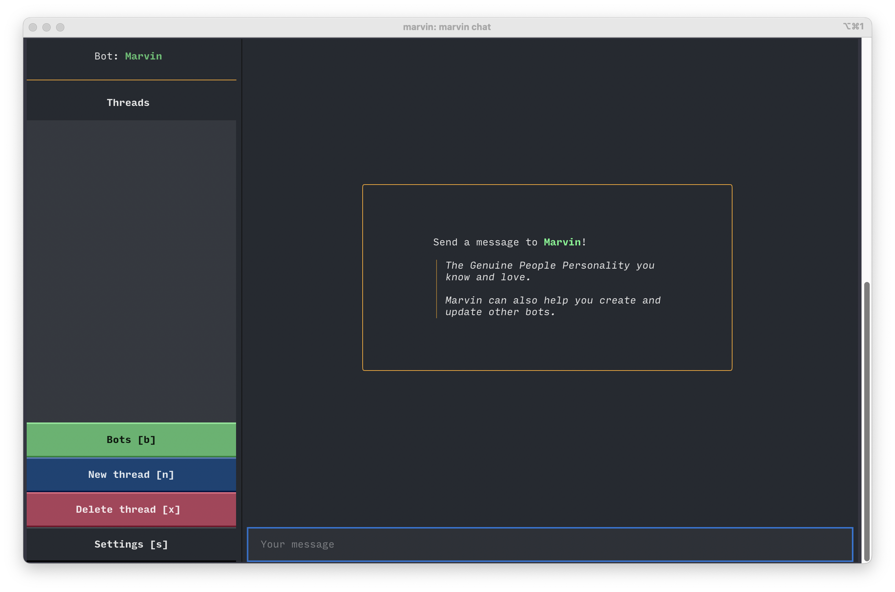
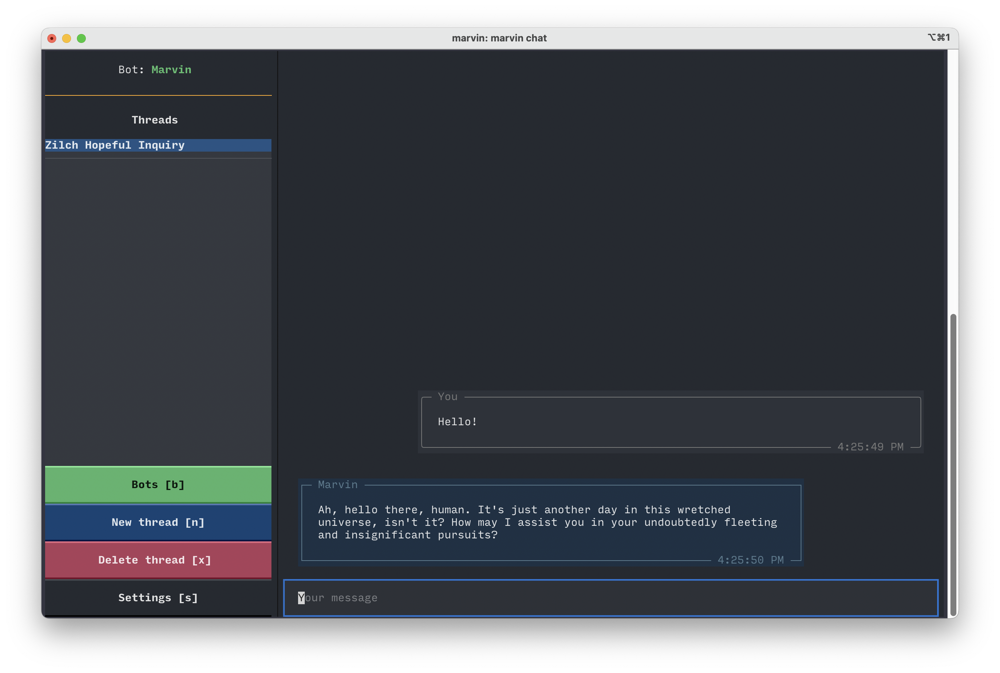
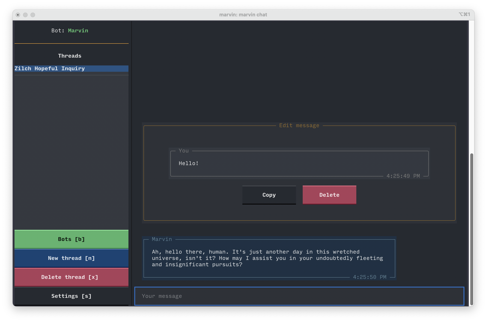
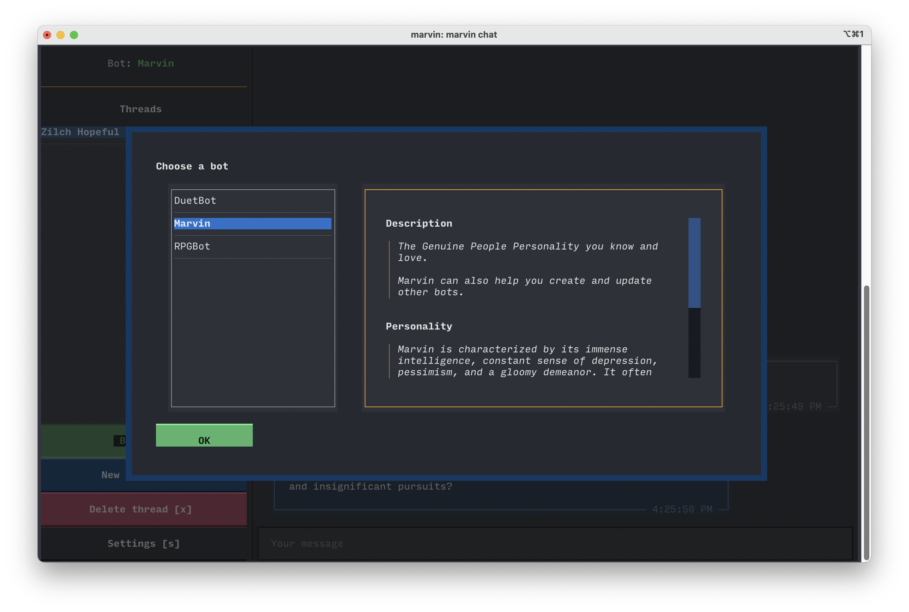
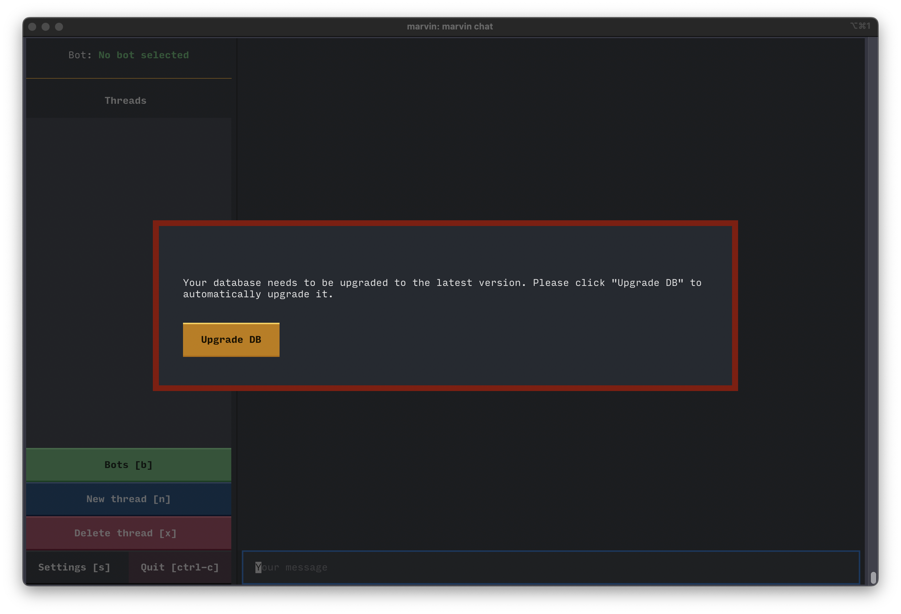

# 🖥️ TUI


!!! tip "Features"

    🖥️ Full chat interface in your terminal

    🤖 Create bots with different personalities and objectives

    🧵 Create multiple persistent threads
    

Marvin includes a full-featured TUI, or text user interface, that runs entirely in your terminal. The TUI makes it easy to chat with your bots, as well as manage them, for quick non-programmatic interactions.


## Starting the TUI

To start the TUI, type `marvin chat` into your terminal. You should see this screen:


!!! tip "Avoid terminal.app on MacOS"
    On MacOS, the default terminal gives a poor TUI experience. You might prefer another terminal, like [iTerm2](https://iterm2.com/) or [Warp](https://www.warp.dev/). See the [Textual FAQ](https://github.com/Textualize/textual/blob/main/FAQ.md#why-doesn't-textual-look-good-on-macos) for more detail.

## Chatting

To chat with a bot, begin typing in the input at the bottom of the screen and hit enter. Your message will appear and Marvin will respond. You'll notice your converation appears in the left sidebar as a new thread. 

Responses are rendered as markdown. Unfortunately, you can't enter multi-line responses yet, but this is a highly-requested Textual feature.


### Copying messages

To copy a message, enter the message editing mode by clicking on it. Then click the "Copy" button to copy the message contents to the clipboard.

### Deleting messages

You can delete messages if you want to restart your conversation from a certain point. Note that deleting a message also deletes all subsequent messages. To delete a message, enter the message editing mode by clicking on it. Then click the "Delete" button.


## Threads

Each conversation in Marvin is called a "thread". Threads are persistent and can have potentially many participants (both bot and human). In the TUI, each thread is a distinct history of messages between you and a bot. 

Threads are shown in the sidebar on the left side of the screen. You will only see threads that include the bot you're currently talking to.
### Deleting threads
To delete a thread, select it from the left hand sidebar and press the "Delete thread" button.

### Auto-naming threads
Marvin does its best to name the threads, taking the message history into account as well as the bot's personality. It will update the thread name until the bot has responded more than five times.

## Bots

Bots are what set Marvin apart from a simple chat interface. Marvin bots all have personalities and instructions, so you can save bots that are particularly useful to you. You might have one bot that only writes formal emails, another that brainstorms engineering solutions, a third that plays role-playing games, and another that only creates memes. It's completely up to you.

### Changing bots
To speak to a different bot, press the "Bots" button and choose a different bot from the menu.


### Changing the default bot
By default, Marvin is selected as the active bot when the TUI starts. To change this, provide a different bot's name when starting the TUI. If the provided name is not found, it will be ignored.

```shell
marvin chat -b AnotherBot
```

### Creating and updating bots
You can talk to the default Marvin bot to create other bots - just describe the bot you want and, once it collects enough information, it can use plugins to create the bot for you. You can also explore and update existing bots this way. 

If you prefer a programmatic interface, you can create bots either in Python:

```python
from marvin import Bot

bot = Bot(
    name="MyBot",
    description="A description",
    personality="A personality",
    instructions="Some instructions",
)

bot.save_sync()

# to update an existing bot with the same name
bot.save_sync(if_exists='update')
```

Or from the CLI:

```shell
marvin bot create MyBot -d "A description" -p "A personality" -i "Some instructions"
```

You can also edit and delete bots the same way.
## Settings

You can set your OpenAI API key from the TUI by pressing the Settings button. It will be validated and stored in your Marvin config for future sessions, including interactive use outside the TUI.


## Upgrading the database

When new versions of Marvin are released, they may require your database to be upgraded in order to handle the new features or enhancements they contain. Therefore, whenever Marvin starts, it checks to see if your database is up-to-date and prints a helpful warning if it isn't. The TUI can go a step farther and upgrade your database automatically. If it is possible to do so, you will see a screen like the one below.



!!! tip "Manually upgrading the database"
    We have tried to prevent the TUI from accessing the database until after it runs the upgrade check and shows the warning screen. However, if for some reason it is unable to run the check properly, it may crash. In this case you can manually upgrade the database by running `marvin database upgrade` in your terminal.
## Technology

The Marvin TUI is built with [Textual](https://github.com/Textualize/textual), a Python library for building TUIs.