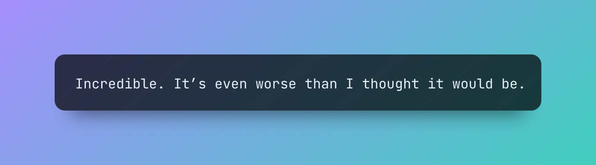

# The Guide

<!--  -->

Welcome to the ever-expanding guide to Marvin. 
The documentation is split into a few key sections:

- **Introduction:** information about configuration and basic use
- **Concepts:** introductions, explanations, and examples of the most important Marvin concepts
- **Examples:** common use cases and examples to help you get started
- **Development:** details on developing the Marvin library itself