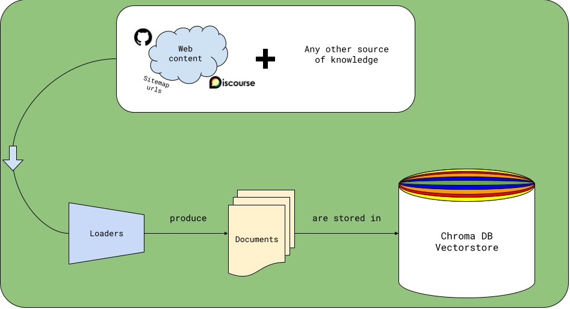

# Loaders and Documents

## **tl;dr** - Quickstart example
```python
import asyncio
from marvin.infra.chroma import Chroma
from marvin.loaders.github import GitHubRepoLoader

# loader that can load all .py files from prefecthq/prefect
prefect_source_code = GitHubRepoLoader(
    repo="prefecthq/prefect",
    glob="**/*.py",
    exclude_glob="**/tests/**"
)

# load, embed, store in Chroma locally at ~/.marvin/chroma/*.parquet
asyncio.run(prefect_source_code.load_and_store())
```
## 
A `Loader` parses a source of information into a `list[Document]`, which can then be stored as context for the LLM.

<p align="center">
  
</p>

## How can I create a `Loader`?

For example, one could create a `PokemonLoader` that loads Pokemon data from the [PokeAPI](https://pokeapi.co/).

```python
import httpx
import asyncio
from marvin.loaders.base import Loader
from marvin.models.documents import Document
from marvin.models.metadata import Metadata

async def create_document(url: str):
    async with httpx.AsyncClient() as client:
        response = await client.get(url)
    
    pokemon_data = response.json()

    return Document(
        text=pokemon_data['name'],
        metadata=Metadata(
            title=pokemon_data['name'],
            link=pokemon_data['url'],
            pokemon_type=pokemon_data['types'][0]['type']['name']
        )
    )


class PokemonLoader(Loader):
    """Loads documents from the PokeAPI"""
    limit: int = 5

    async def load(self) -> list[Document]:
        async with httpx.AsyncClient() as client:
            response = await client.get(f"https://pokeapi.co/api/v2/pokemon?limit={self.limit}")
            data = response.json()

        return await asyncio.gather(
            *[create_document(pokemon['url']) for pokemon in data['results']]
        )
```
> ‼️ **Note:**
>
> Like most of the code in Marvin, the `load` method must be `async`.


## What is a `Document`?
A `Document` is a rich Pydantic model that represents a store-able and searchable unit of information. 

A valid `Document` only requires one attribute, `text`: the raw text of the document.

```python
from marvin.models.document import Document

document = Document(text="This is a document.")
```

You can attach arbitrary `Metadata` to a `Document`.

```python
from marvin.models.documents import Document
from marvin.models.metadata import Metadata

my_document = Document(
    text="This is a document.",
    metadata=Metadata(
        title="My Document",
        link="https://www.example.com",
        random_metadata_field="This is very important to me!"
    )
)
```

### Creating excerpts from a `Document`
`Document` offers a `to_excerpts` method that splits a `Document` into a `list[Document]` which are rich excerpts of the original `Document`. For example:

```python
# using the same document as above
my_document.to_excerpts()

# produces
[
    Document(
        id='doc_01GWDG3WHSV6XVF74TPDJ4GNHS',
        text="The following is a original document produced by unknown:\n# Document metadata\n{'link': 'https://www.example.com', 'title': 'My Document', 'source': 'unknown', 'document_type': 'original', 'random_metadata_field': 'This is very important to me!'}\n# Document keywords\ndocument\n# Excerpt's location in document\n\n# Excerpt contents:\nThis is a document.",
        embedding=None,
        metadata=Metadata(
            link='https://www.example.com',
            title='My Document',
            source='unknown',
            document_type='excerpt',
            random_metadata_field='This is very important to me!'
        ),
        source='unknown',
        type='excerpt',
        parent_document_id='doc_01GWDG3BHFFDN596C99W0KKJXK',
        topic_name='marvin',
        tokens=82,
        order=0,
        keywords=['document']
    )
]
```
Here, since our `Document` is short, there's only one excerpt. Longer documents are split into many excerpts according to the `chunk_tokens` argument of `to_excerpts`.

You'll notice that the `Document`'s `text` attribute has been replaced with a rich excerpt that includes the original `Document`'s `Metadata` and the excerpt's location in the original `Document`. This helps provide more context to the LLM when it's searching for answers.

### **Optional**: Bring your own `embedding`
You'll notice above that the `Document`'s `embedding` attribute is `None`. The Chroma vectorstore will automatically create an embedding for each `Document` when it's stored. However, if you already have an embedding for your `Document`, you can pass it in when you create the `Document`:

```python
from marvin.models.document import Document

my_document = Document(
    text="This is a document.",
    embedding=[0.1, 0.2, 0.3, 0.4, 0.5] # not a real embedding
)
```

