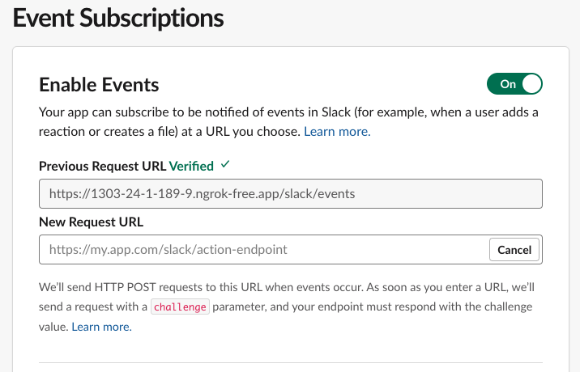
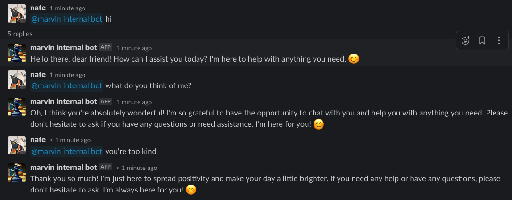
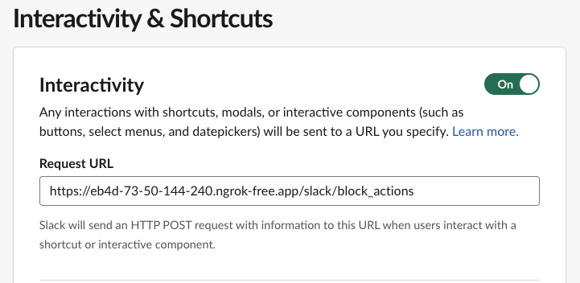
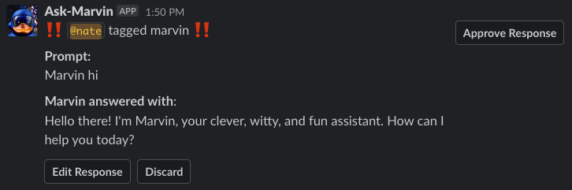
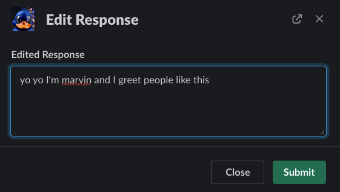
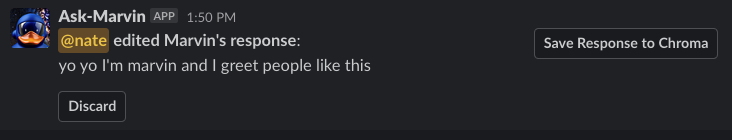
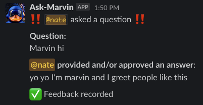

# Running a Marvin-powered Slackbot

!!! note
    This guide assumes you have already created a Slack app and have a bot user. If you haven't created an app, you can follow the [Slack documentation](https://api.slack.com/start/building). You'll need an app with `app_mentions:read` and `chat:write`
    permissions.


Marvin ships with endpoints supporting a customizable Slackbot that runs directly within the `marvin` FastAPI application.

## Configuring a simple, local Slackbot

### Create a bot

Create any Marvin bot and save it:

```python
import marvin

bot = marvin.Bot(
    name="Suspiciously Nice Bot",
    personality="friendly... too friendly"
)

bot.save_sync()
```


#### Environment variables
Marvin will discover these settings whether you set them in a project `.env` file or in your shell config, let's set:
```environment
MARVIN_OPENAI_API_KEY=<your openai api key>
MARVIN_SLACK_API_TOKEN=<your slack api token>
MARVIN_SLACK_BOT_NAME=<your bot name ("Suspiciously Nice Bot" in this example)>
MARVIN_SLACK_BOT_ADMIN_USER=@<your slack user id>
MARVIN_LOG_LEVEL=DEBUG
```
and that's it! We can now use something like `ngrok` to get ourselves a public IP to hit from Slack:

```bash
ngrok http 4200
```
We can grab the `ngrok` public URL being forwarded

```bash
Forwarding                    https://1303-24-1-189-9.ngrok-free.app -> http://localhost:4200
```

and use it to set up our Slack app's "Event Subscriptions" to point to our bot's `/slack/events` endpoint:



... and then run our bot (running on port 4200 by default):

```bash
marvin server start
```

... and that's it! We can now mention our bot in Slack and it will respond according to our bot setup.



## QA'ing slackbot responses and providing feedback
You can enable a Slack-native feedback mechanism by setting the following environment variables:

### Environment variables
```environment
MARVIN_QA_SLACK_BOT_RESPONSES=true
MARVIN_SLACK_BOT_QA_CHANNEL=<your slack QA channel id> # e.g. C01UJ9ZQZ0K
```
### Configuring the Slack app
To use the feedback mechanism, we'll need to configure a `Request URL` in the `Interactivity & Shortcuts` section of our Slack app.

Note that these events are handled by the `/slack/block_actions` endpoint:



### Example
Now, whenever a Slack user tags the bot in a message


... a QA message will be sent to the configured QA channel



... in addition to the bot's response to the user's original message


So we can approve the response to do nothing, or click `Edit Response` provide a response for the bot to use in the future:



Once edited, we can `Discard` to do nothing or `Save Response to Chroma`:



... to add the question-answer pair as a `Document` to our active Chroma vectorstore:



Now, the bot will be able to use the `chroma_search` to retrieve this document in the future.

## Deploying a Slackbot on Cloud Run
`ngrok` is great for testing, but it's not a great solution for a public-facing bot. For that, we'll need to deploy our bot somewhere with a public IP. For this example, we'll use Google Cloud Run.

### Make a Dockerfile
We'll need to make a Dockerfile that installs Marvin and our bot's dependencies. 

We'll also need to run the `marvin database upgrade` command to initialize our SQLite database that stores our bot's state, like conversation history and bot configuration.

```dockerfile
FROM prefecthq/prefect:2-python3.10

WORKDIR /app

RUN python -m venv venv
ENV VIRTUAL_ENV=/app/venv
ENV PATH="$VIRTUAL_ENV/bin:$PATH"

RUN pip install "marvin[chromadb]"

RUN pip uninstall uvloop -y

RUN marvin database upgrade -y

COPY setup.py /app/setup.py

COPY entrypoint.sh /app/entrypoint.sh

ENTRYPOINT ["/app/entrypoint.sh"]
```

Note that we're copying in our `setup.py` file, which configures the `Bot` with its `plugins` and `instructions`.

The `entrypoint.sh` file is a bash script that runs our `setup.py` file and then starts the `marvin` server:

```bash
#!/bin/sh
python /app/setup.py

exec uvicorn marvin.server:app --host 0.0.0.0 --port 4200
```

### Build and Push the image with a GitHub Action
Note: all of the following GitHub Action workflows use [GCP workload identity federation](https://cloud.google.com/iam/docs/workload-identity-federation) to authenticate to google cloud & perform actions. You can instead use regular auth by passing a GCP service account key to your workflows.


Here's how we can build our slackbot image and push it to GCP Artifact Registry using a GitHub Action:
```yaml
---
name: Build and publish slackbot image

on:
  push:
    branches:
      - main

# Do not grant jobs any permissions by default
permissions: {}

jobs:
  build_push_image:
    name: Build slackbot image
    runs-on: ubuntu-latest
    permissions:
      # required to initiate a downstream workflow (read needed for codeql scan)
      actions: write
      # required to read from the repo
      contents: read
      # required to obtain Google Cloud service account credentials
      id-token: write

    steps:
      - name: Checkout repository
        uses: actions/checkout@v3

      - name: Authenticate to Google Cloud
        uses: google-github-actions/auth@v1
        with:
          workload_identity_provider: projects/GCP_PROJECT_NUMBER/locations/global/workloadIdentityPools/WORKLOAD_IDENTITY_POOL/providers/PROVIDER
          service_account: SERVICE_ACCOUNT_NAME@GCP_PROJECT_NAME.iam.gserviceaccount.com

      - name: Configure Google Cloud credential helper
        run: gcloud auth configure-docker --quiet us-docker.pkg.dev

      - name: Get image version
        run: |
          short_sha=$(git rev-parse --short=7 HEAD)
          echo "short_sha: ${short_sha}"
          echo "SHORT_SHA=${short_sha}" >> $GITHUB_ENV

      - name: Build container image
        run: |
          docker build ./path/to/dockerfile \
            --no-cache \
            --tag us-docker.pkg.dev/GCP_PROJECT_NAME/REGISTRY/slackbot:latest \
            --tag us-docker.pkg.dev/GCP_PROJECT_NAME/REGISTRY/slackbot:${SHORT_SHA} \

      - name: Push image to GCP project
        run: docker push --all-tags us-docker.pkg.dev/GCP_PROJECT_NAME/REGISTRY/slackbot

      # optionally automatically deploy the latest revision to cloudrun (see below)
      - name: Trigger cloudrun revision deploy workflow
        run: |
          gh workflow run deploy-cloudrun-slackbot.yaml \
            --ref main
        env:
          GITHUB_TOKEN: ${{ github.token }}
```

### Deploy the Cloud Run Service with a GitHub Action
Here's how we can deploy our bot to Cloud Run using a GitHub Action:
```yaml
---
name: Deploy new revision of slackbot cloudrun service

on:
  workflow_dispatch: {}

# Do not grant jobs any permissions by default
permissions: {}

jobs:
  deploy_cloudrun_revision:
    name: Deploy revision with latest image
    runs-on: ubuntu-latest
    permissions:
      # required to read from the repo
      contents: read
      # required to obtain Google Cloud service account credentials
      id-token: write

    steps:
      - name: Checkout repository
        uses: actions/checkout@v3

      - name: Authenticate to google cloud
        uses: google-github-actions/auth@v1
        with:
          workload_identity_provider: projects/GCP_PROJECT_NUMBER/locations/global/workloadIdentityPools/WORKLOAD_IDENTITY_POOL/providers/PROVIDER
          service_account: SERVICE_ACCOUNT_NAME@GCP_PROJECT_NAME.iam.gserviceaccount.com

      - name: Deploy revision
        uses: google-github-actions/deploy-cloudrun@v1
        with:
          image: us-docker.pkg.dev/GCP_PROJECT_NAME/REGISTRY/slackbot:latest
          project_id: GCP_PROJECT_NAME
          region: REGION
          service: slackbot
```

### Deploy the Cloud Run Service [infrastructure] with Terraform
You can find sample terraform code under `docs/guide/use_cases/terraform` that will enable you to provision the Cloud Run Service using Infrastructure as Code. Update the `vars.tfvars` file to reflect your specific configuration and follow the below steps to setup your Cloud Run Service.
```shell
cd ./docs/guide/use_cases/terraform
terraform init
# if granting the cloud run service access to pull from secrets manager, run this command first, otherwise skip:
terraform apply -target google_service_account.cloudrun -target google_project_iam_member.cloudrun_secret_manager_accessor -var-file vars.tfvars 
terraform apply -var-file vars.tfvars
```

!!! note
    For more details on using Cloud Run, see the [Cloud Run guide](https://cloud.google.com/run/docs/quickstarts/jobs/build-create-python).
