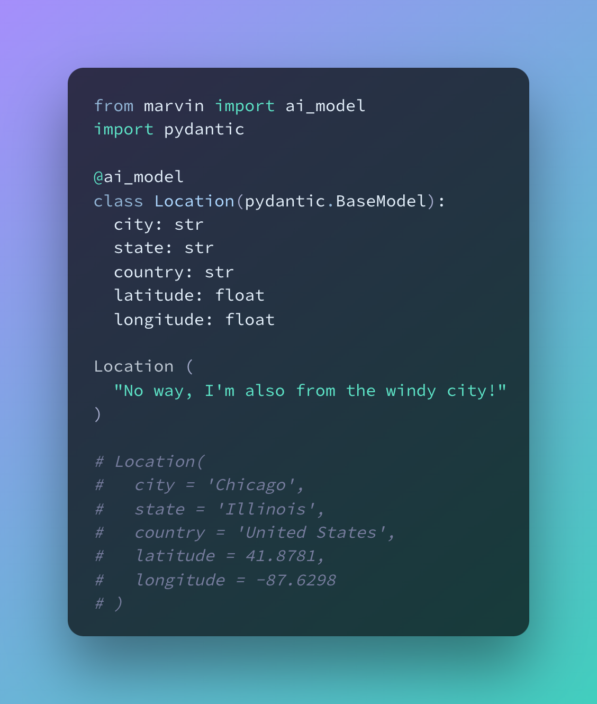
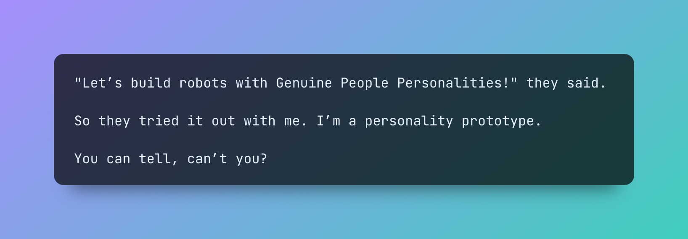
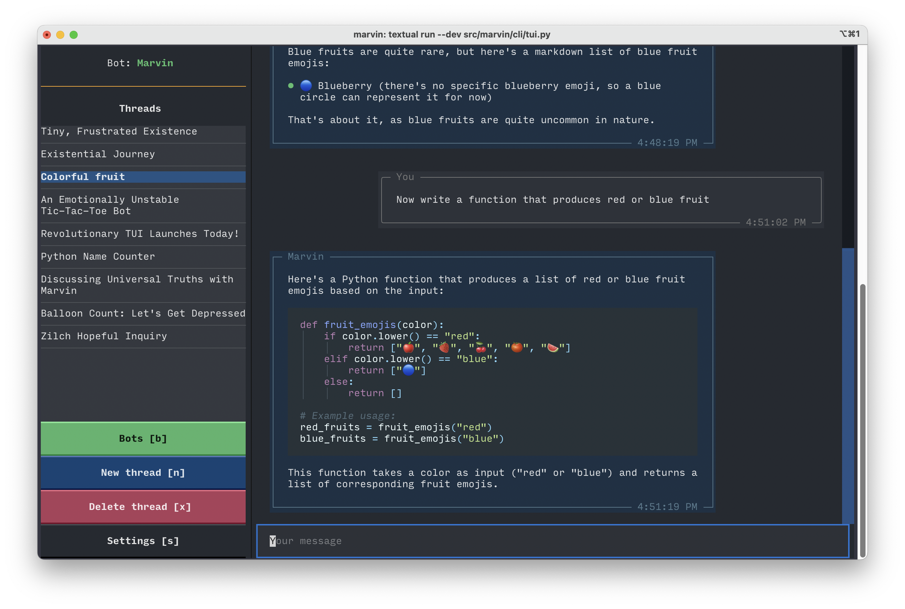
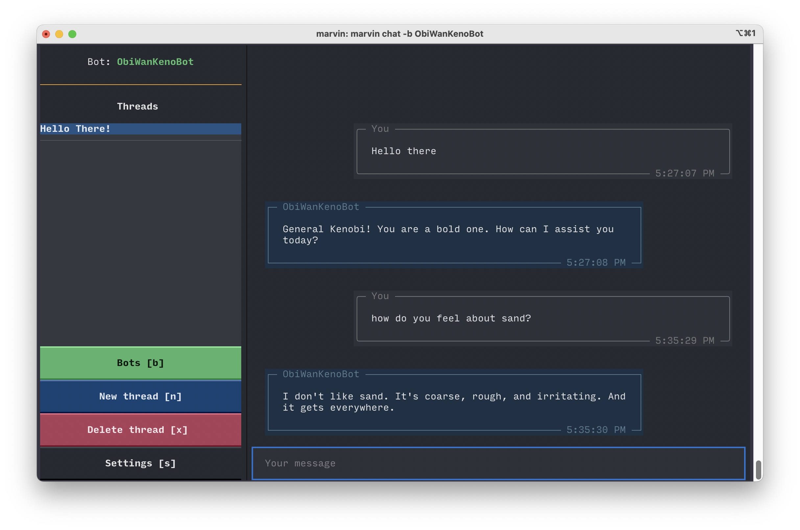

# Welcome to Marvin 🤖🏖️

{ width="400" }

Meet [Marvin](https://github.com/prefecthq/marvin): a batteries-included library for building AI-powered software. Marvin's job is to integrate AI directly into your codebase by making it look and feel like any other function. Marvin is building the gears, cranks, and pistons to let mechanical software systems integrate with and leverage the raw power of Large Language Models.

Marvin introduces two new concepts:

  - [**AI Models**](guide/concepts/ai_models.md). These models, grounded in Pydantic, offer a transformative approach to data processing by converting unstructured contexts into type-safe outputs that validate against your model schema. This empowers you to interrogate your data through your schema. AI models present an elegant solution that combines the potent reasoning capabilities of AI with the sturdy, type-safe boundaries set by Pydantic.


  - [**AI Functions**](guide/concepts/ai_functions.md). These functions differ from conventional ones in that they don’t rely on source code, but instead generate their outputs on-demand with AI by using an LLM as a runtime. With AI functions, you don't have to write complex code for tasks like extracting entities from web pages, scoring sentiment, or categorizing items in your database. Just describe your needs, call the function, and you're done!


AI functions and models work with native data types, so you can seamlessly integrate them into any codebase and chain them into sophisticated pipelines. Technically speaking, Marvin transforms the signature of using AI from `(str) -> str` to `(**kwargs) -> Any`. 
    
Marvin leverages **"functional prompt engineering"** to build a battle-tested and typesafe interface to LLMs. We expose our API through drop-in decorators, creating an unparalleled developer experience so that every developer can reach for LLMs when it's the right tool. 

Marvin is powered by a fleet of powerful, flexible, and secure bots. [**Bots**](guide/concepts/bots.md) are highly capable AI assistants that can be given specific instructions and personalities or roles. They can use custom plugins and leverage external knowledge, and automatically create a history of every thread. Under the hood, AI functions are actually a type of bot. 

To make it easy to work with bots, Marvin includes a fully-functional [**TUI**](guide/concepts/tui.md). The TUI tracks threads across multiple bots and even lets you manage your bots through a conversational interface.

Developers can use Marvin to add AI capabilities wherever they will be most impactful, without needing to start from scratch. Marvin's code is available on [GitHub](https://github.com/prefecthq/marvin), and say hello on our [Discord server](https://discord.gg/Kgw4HpcuYG)!

Marvin is built with 💙 by [Prefect](https://www.prefect.io).

<!-- !!! quote "GPP"
    "Let’s build robots with Genuine People Personalities!" they said. So they tried it out with me. I’m a personality prototype. You can tell, can’t you?
    
    -- <a href="https://www.youtube.com/clip/UgkxNj9p6jPFM8eWAmRJiKoPeOmvQxb8viQv" target="_blank">Marvin</a> -->
    
## Features
<!--  -->


⚙️ Create [AI Models](guide/concepts/ai_models.md) to make data models that can derive structured information from unstructured text data

🪄 Write [AI functions](guide/concepts/ai_functions.md) to process structured data without source code or generate high quality synthetic data

🤖 Build [bots](guide/concepts/bots.md) that have personalities and follow instructions

🖥️ Chat with bots in a fully-featured [TUI](guide/concepts/tui.md)

🔌 Give your bots new abilities with [plugins](guide/concepts/plugins.md) 

📚 Store [knowledge](guide/concepts/loaders_and_documents.md) that bots can access and use

📡 Available as a Python API, interactive CLI, or FastAPI server

## Quick start
1. **Install**: `pip install marvin`
2. **Chat**: `marvin chat`

### Slightly less quick start
Create a bot:
```shell
marvin bots create ObiWanKenoBot -p "knows every Star Wars meme"
```
Chat with it:
```
marvin chat -b ObiWanKenoBot
```



See the [getting started](getting_started/installation.md) docs for more.

## Open source

Marvin is open-source with an Apache 2.0 license and built on standards like Pydantic, FastAPI, Langchain, and Prefect. The code is available on [GitHub](https://github.com/prefecthq/marvin).

!!! warning "Construction zone"
    Marvin is under active development and is likely to change. 

### Coming soon

♻️ Interactive AI functions

🖼️ Admin and chat UIs

🏗️ Advanced data loading and preprocessing

🔭 AI orchestration and observability platform

🚀 Quick deploys of LLM-powered APIs

🎁 Quickstarts for common use cases

## When should you use Marvin?

Marvin is an opinionated, high-level library with the goal of integrating AI tools into software development. There are a few major reasons to use Marvin:

1. **You want an [AI function](guide/concepts/ai_functions.md) that can process structured data.** Marvin brings the power of AI to native data structures, letting you build functions that would otheriwse be difficult or even impossible to write. For example, you can use AI functions to make a list of all the animals in a paragraph, generate JSON documents from HTML content, extract keywords that match some criteria, or categorize sentiment -- without any traditional source code.

2. **You want an [AI assistant](guide/concepts/bots.md) in your code.** Marvin's bots can follow instructions and hold conversations to solve complex problems. They can use custom plugins and take advantage of external knowledge. They are designed to be integrated into your codebase, but of course you can expose them directly to your users as well!

3. **You want to deploy cutting-edge AI technology with confidence, but without having to make too many decisions.** Using LLMs successfully requires very careful consideration of prompts, data preprocessing, and infrastructure. Our target user is more interested in *using* AI systems than *building* AI systems. Therefore, Marvin is designed to make adopting this technology as straightforward as possible by optimizing for useful outcomes. Marvin's prompts have been hardened by months of real-world use and will continue to improve over time.
## When should you NOT use Marvin?
There are a few reasons NOT to use Marvin:

1. **You want full control of an AI.** Marvin is a high-level library and (with few exceptions) does not generally expose LLM configuration to users. We have chosen settings that give the best results under most circumstances, taking Marvin's built-in prompts into consideration.
   
2. **You want an AI copilot for writing code.** Marvin's job isn't to help you write source code; it's to help you do things that are difficult or impossible to express in source code. That could range from mundane activities to writing a function that can extract the names of animals commonly found in North America from an email (yes, it's a ridiculous example - but it's possible). Modern LLMs excel at complex reasoning, and Marvin lets you bring that into your code in a way that feels native and natural.

3. **You want full control of your prompts.** As a "functional prompt engineering" platform, Marvin takes user inputs and generates prompts that are likely to deliver the outcome the user wants, even if they are not verbatim what the user said. Marvin does not expect users to send completely raw prompts to the LLM. 

4. **You're searching for the Ultimate Question.** While Marvin is highly intelligent, even he couldn't come up with the Ultimate Question of Life, the Universe, and Everything. If you're seeking existential enlightenment, you might need to look beyond our beloved paranoid android.
