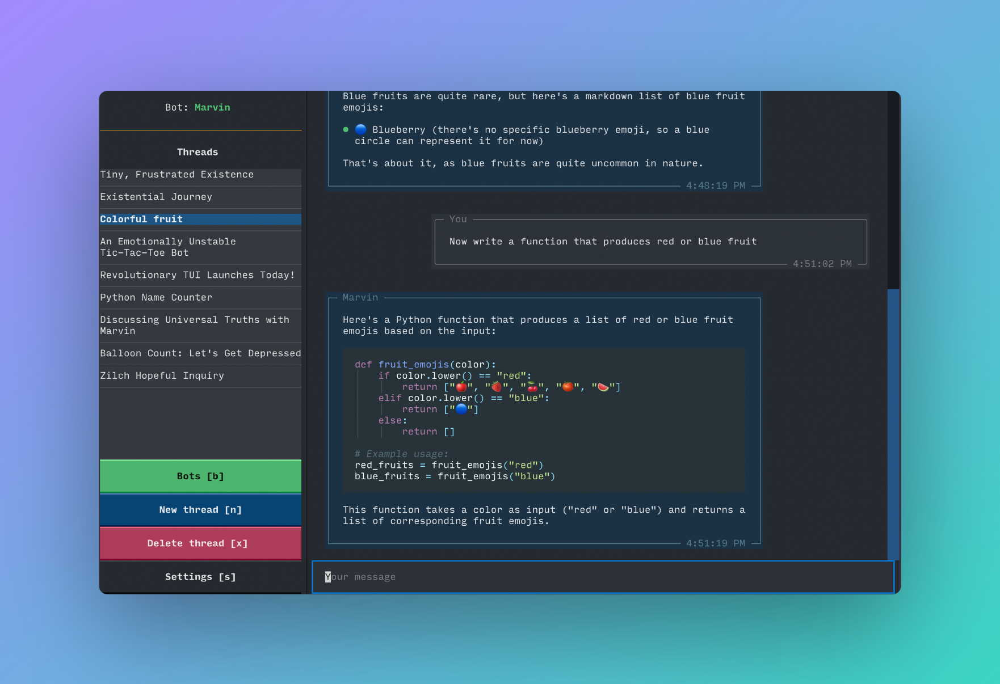

# Chat


## Quick chat

To quickly jump into a chat, run `marvin chat` from your command line. This will open a new session with the default chatbot, whose name is Marvin. You can type messages to the bot, and it will respond. 

```shell
marvin chat
```


To learn more about the Marvin TUI, see its [documentation](tui.md)