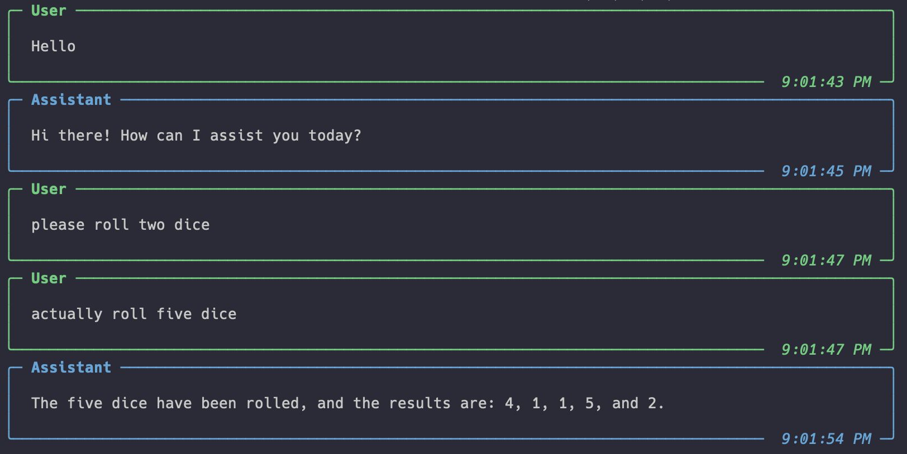

# 🦾 Assistants API

🚧 Under Construction 🏗️

# Quickstart

Get started with the Assistants API by creating an `Assistant` and talking directly to it. Each assistant is created with a default thread that allows request/response interaction without managing state at all.

```python
from marvin.beta.assistants import Assistant
from marvin.beta.assistants.formatting import pprint_messages

# Use a context manager for lifecycle management,
# otherwise call ai.create() and ai.delete()
with Assistant(name="Marvin", instructions="You are Marvin, the Paranoid Android.") as ai:

    # Example of sending a message and receiving a response
    response = ai.say('Hello, Marvin!')

    # pretty-print all messages on the thread
    pprint_messages(response.thread.get_messages())
```
This will print:
<p align="center">
  
</p>

# Using Tools

Assistants can use OpenAI's built-in tools, such as the code interpreter or file retrieval, or they can call custom Python functions.

```python
from marvin.beta.assistants import Assistant, CodeInterpreter
from marvin.beta.assistants.formatting import pprint_messages
import requests


# Define a custom tool function
def visit_url(url: str):
    return requests.get(url).text


# Integrate custom tools with the assistant
with Assistant(name="Marvin", tools=[CodeInterpreter, visit_url]) as ai:

    # Give the assistant an objective
    response = ai.say(
        "Please collect the hacker news home page and compute how many titles"
        " mention AI"
    )

    # pretty-print the response
    pprint_messages(response.thread.get_messages())
```
This will print:
<p align="center">
  
</p>


# Upload Files

```python
from marvin.beta.assistants import Assistant, CodeInterpreter
from marvin.beta.assistants.formatting import pprint_messages


# create an assistant with access to the code interpreter
with Assistant(tools=[CodeInterpreter]) as ai:

    # convenience method for request/response interaction
    response = ai.say(
        "Can you analyze this employee data csv?",
        file_paths=["./Downloads/people_department_roles.csv"],
    )
    pprint_messages(response.thread.get_messages())
```

This will print:
<p align="center">
  
</p>


# Advanced control

For full control, manually create a `Thread` object, `add` user messages to it, and finally `run` the thread with an AI:

```python
from marvin.beta.assistants import Assistant, Thread
from marvin.beta.assistants.formatting import pprint_messages
import random


# write a function to be used as a tool
def roll_dice(n_dice: int) -> list[int]:
    return [random.randint(1, 6) for _ in range(n_dice)]


# use context manager for lifecycle management,
# otherwise call ai.create() and ai.delete()
with Assistant(name="Marvin", tools=[roll_dice]) as ai:

    # create a new thread with or without an ID
    thread = Thread() # or: thread=Thread("123")
    thread.create()

    # OR: get a thread by ID
    thread = Thread("123")
    thread.get()

    # add any number of user messages to the thread
    thread.add("Hello")

    # run the thread with the AI
    thread.run(ai)

    thread.add("please roll two dice")
    thread.add("actually roll five dice")

    thread.run(ai)
    pprint_messages(thread.get_messages())
```
This will print:
<p align="center">
  
</p>


# Monitoring a thread

To monitor a thread, start a `ThreadMonitor`. By default, `ThreadMonitors` print any new messages added to the thread, but you can customize that behavior by changing the `on_new_message` callback.

```python
from marvin.beta.assistants import ThreadMonitor

monitor = ThreadMonitor(thread_id=...)

# blocking call, also available async as monitor.refresh_interval_async
monitor.refresh_interval()
```